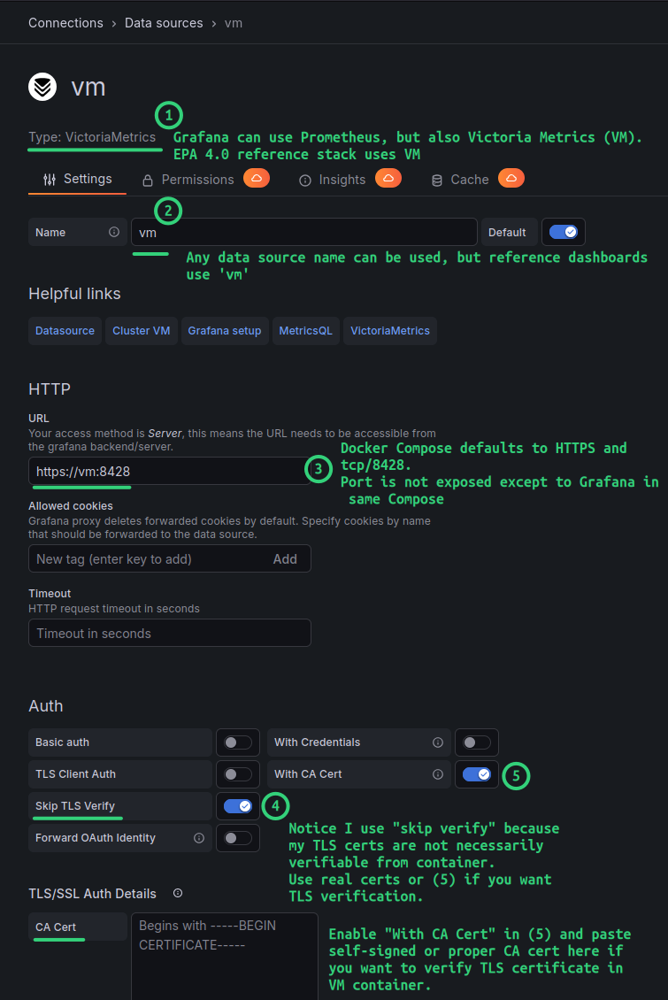

# Configuration

## Prepare data directories

This step is needed if you plan to run Compose stack, which requires data directories for Grafana and Victoria Metrics.

```sh
./scripts/setup-data-dirs.sh
```

`./data/[grafana,grafana-dashboards,vm]` will be created with correct permissions as a result.

I'm not even sure the second sub-directory is required, but it may be if you want to upload own dashboards or something along those lines. They don't take up any space so it doesn't really matter.

## Prepare TLS certificates

This step is required if you plan to run Victoria Metrics or Grafana as these require TLS certificates. If you provide your own, you can skip this step.

```sh
./scripts/gen_ca_tls_certs.py -h
```

## Configure and test Collector's Prometheus service port

- Set it in `.env` (default: `9080`), Compose, or with `python3 ./epa/collector.py --prometheus-port 9080` when running from the CLI
- Use `curl http://COLLECTOR:<PROM_PORT>/metrics` to verify it's working
- If you change Prometheus port to another value *and* want to use Victoria Metrics, set the same port in `./vm/prometheus.yml` before starting Victoria Metrics service

## Run Collector

These arguments and switches are available in Compose as well.

```sh
python3 ./epa/collector.py -h
usage: collector.py [-h] [-u USERNAME] [-p PASSWORD] [--api API [API ...]] 
    [--api-port API_PORT] [-t {60,120,300,600}] [-s] [-v] [--showFlashCache] [-f] [-a] [-d]
    [-b] [-ct] [-c] [-m] [-e] [-g] [-pw] [-en] [-i] [--debug] [--debug-force-config] 
    [--include INCLUDE [INCLUDE ...]] [--prometheus-port PROMETHEUS_PORT] 
    [--max-iterations MAX_ITERATIONS] [--capture [DIR]] [--no-verify-ssl]

```

Some of the more important ones:

```sh
options:
  -h, --help            show this help message and exit
  -u USERNAME, --username USERNAME
                        Username to connect to the SANtricity API. Required. Default: 'monitor'. <String>
  -p PASSWORD, --password PASSWORD
                        Password for this user to connect to the SANtricity API. Required. Default: ''. <String>
  --api API [API ...]   The IPv4 address for the SANtricity API endpoint. Required. Example: --api 5.5.5.5 6.6.6.6. Port number is auto-set to: '8443'. May be
                        provided twice (for two controllers). <IPv4 Address>
  --api-port API_PORT   The port for the SANtricity API endpoint. Default: '8443'.
  -t {60,120,300,600}, --intervalTime {60,120,300,600}
                        Interval (seconds) to poll and export data from the SANtricity API. Default: 60. <Integer>
  -i, --showIteration   Outputs the current loop iteration. Optional. <switch>
  --debug               Enable debug logging to show detailed collection and filtering information. Optional. <switch>
  --debug-force-config  Force config data collection every iteration (for testing). Optional. <switch>
  --prometheus-port PROMETHEUS_PORT
                        Port for Prometheus metrics HTTP server. Default: 8080. Only used when --output includes prometheus.
  --max-iterations MAX_ITERATIONS
                        Maximum number of collection iterations to run (0 = unlimited). Useful for testing. Default: 0.
  --capture [DIR]       Capture SANtricity API request/response payloads to disk for replay or debugging. Optionally specify a directory; if omitted, files are
                        stored under ./captures/<timestamp>.
  --no-verify-ssl       Disable TLS/SSL certificate verification for SANtricity API connections. Use only in lab/dev environments with self-signed certificates.
                        Default: False (verification enabled).
```

Simplest run using default `monitor` account:

```sh
python3 ./epa/collector.py --api 1.2.3.4  --password monitor123 --no-verify-ssl 
```

Add `--debug --max-iterations 20 --capture /tmp/epa` to get debug logs for a 20 minute period (as some metrics are collected on a slow schedule).

## Configure Grafana data source in Victoria Metrics

Any Prometheus scraper (and database) can be used to scrape EPA Collector metrics. My EPA reference stack uses Victoria Metrics.

If you run use reference stack (Collector, Grafana, Victoria Metrics), Grafana's data source will be done automatically when you run the above two steps and `grafana-init` container.



If you use own Grafana **and** choose to use Victoria Metrics from EPA stack:

- You need to expose service port for `vm` service in docker-compose.yml to allow Grafana to reach Victoria Metrics from the outside
- Allow external access from Grafana to the Victoria Metrics port from Compose file
- Copy any CA/Victoria Metrics certificates to Grafana to enable TLS validation if you do not wish to skip/disable that
- Additionally, you may enable authentication on V or limit access to specific Grafana (source) IP

If you use own Grafana and own Prometheus scraper and database, just make sure Collector's Prometheus Port is exposed to your scraper.

## Downsampling and retention for scraped data in Victoria Metrics

It's all done automatically by Victoria Metrics. Data retention is set to 90 days in the Compose YAML.

Refer to the Victoria Metrics documentation for the details on modifying values.
