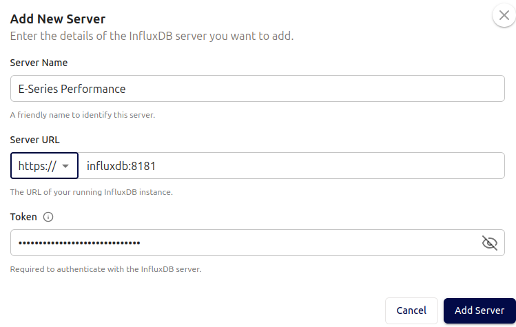
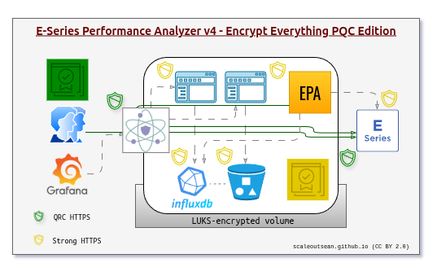

# Documentation for E-Series Performance Analyzer (EPA)

- [Documentation for E-Series Performance Analyzer (EPA)](#documentation-for-e-series-performance-analyzer-epa)
  - [Introduction](#introduction)
  - [Architecture](#architecture)
  - [Configuration](#configuration)
    - [Configuration files](#configuration-files)
      - [TLS certificates](#tls-certificates)
      - [Secrets](#secrets)
      - [Authentication](#authentication)
  - [Containers](#containers)
    - [Utilities (`utils`)](#utilities-utils)
    - [Reverse proxy (`nginx`)](#reverse-proxy-nginx)
    - [InfluxDB (`influxdb`)](#influxdb-influxdb)
    - [InfluxDB Explorer (`influxdb3-ui`)](#influxdb-explorer-influxdb3-ui)
    - [S3 (`s3`)](#s3-s3)
    - [S3 Console](#s3-console)
    - [Collector (`collector`)](#collector-collector)
    - [Grafana (`grafana`)](#grafana-grafana)
  - [Maintenance](#maintenance)
    - [Containers](#containers-1)
    - [Storage](#storage)
      - [Storage capacity](#storage-capacity)
      - [Storage performance](#storage-performance)
  - [EPA Collector arguments](#epa-collector-arguments)
    - [`api`](#api)
    - [`showReachability`](#showreachability)
    - [`showSantricity`](#showsantricity)
    - [`toJson` and `fromJson`](#tojson-and-fromjson)
    - [`maxIterations`](#maxiterations)
    - [`bootstrapInfluxDB`](#bootstrapinfluxdb)
    - [`tlsCa` and `tlsValidation`](#tlsca-and-tlsvalidation)
  - [Security](#security)
  - [Data collection and privacy policy](#data-collection-and-privacy-policy)


## Introduction

E-Series Performance Analyzer (EPA) gathers performance and diagnostic information from NetApp SANtricity storage systems and stores it for monitoring, analysis.

This document has some details on the high level architecture, role of each component and settings relevant to integration and functioning of EPA.

To install and configure in a step-by-step manner, see [GETTING_STARTED.MD](GETTING_STARTED.md). Tips and examples of accessing InfluxDB 3 are in [TIPS.md](TIPS.md). The FAQs are [here](FAQ.md).


## Architecture

Collection starts with `app/collector.py` which runs the program. There are three main flows. Most users will use the normal flow: `collector.py` connects to E-Series and InfluxDB, queries API endpoints of the former, massages data and writes it to the latter.

```raw
        Normal Flow:
        [SANtricity API] → [Collectors] → [InfluxDB]
                                ↓
                        [JSON Files BYPASSED]
        --toJson Flow:
        [SANtricity API] → [Collectors] → [JSON Files]
                                ↓ 
                        [InfluxDB BYPASSED]
        
        --fromJson Flow:
        [JSON Files] → [JSON Replay] → [InfluxDB] 
               ↓
        [SANtricity API BYPASSED]        
```

In the normal workflow, once data are in InfluxDB, you can use any HTTP client to access it. Some choices:

- InfluxDB Explorer - SQL-centric Web client
- Grafana - mostly visualization
- InfluxDB 3 Client - in the `utils` container
- `curl` for DIY access from `utils`

Alerts and notifications can be configured either in InfluxDB 3 (API, CLI or from InfluxDB Explorer) or Grafana. 

## Configuration

Main configuration-related files are directories:

- Main app configuration: `config.yml` (config.yaml.example)
- Environment variables: `.env` (env.example)
- Docker services: `docker-compose.yaml` (not needed for CLI users)
- Container configs: `./docker-config/` directory with pre-generated files
- Secrets config: `./secrets` generated secrets
- TLS certificates: `./certs` CA and TLS certificates for containers

You can run EPA Collector from the CLI without any config files. That's the easiest way to see it in action.

But, since TLS validation is by default enabled, you will likely have to do some work or else run with lame security in place.

### Configuration files

#### TLS certificates

This table may help you understand TLS-related configuration and interactions.


| Service            | Service cert | Other cert                 |
|--------------------|--------------|----------------------------|
| InfluxDB           | Y            | CA                         |
| InfluxDB Explorer  | -            | CA, InfluxDB               |
| EPA Collector      | -            | CA, InfluxDB, Nginx, S3    |
| Nginx              | Y*           | (all*) CA                  |
| S3                 | Y            | CA                         |
| S3 Console         | Y            | CA, S3                     |
| utils              | -            | CA                         |


It is up to you but, because Nginx exposes its service to LAN users, even if you generated snake-oil TLS for "in-Docker" services, you could have Nginx use company-issued CA for LAN. But, in order to validate services with snake oil TLS certificates behind it, it would also need to import the self-created CA. If the entire stack uses TLS certificates created by a single CA, then just load that one CA in Nginx.

Once those certificates are ready, services load them through Docker Compose or other method (such as creating a Docker image that includes them). You may inspect `./docker-compose.yaml` to see how the Docker Compose approach works.

#### Secrets

Depending on what/how you use EPA, you may want to check these files and directories

- `./app/config.yaml` - only if you run from the CLI (not used in Collector container) and want to keep EPA Collector configuration details in there
- `.env` - for Docker Compose users, but also used by EPA in CLI mode if it doesn't get these from the user or `/app/config.yaml`
- `./docker-compose.yaml` - also for Docker Compose, especially you hate `.env` files
- `./secrets/` - secrets for services 
- `./docker-config/` - configuration files used by Docker Compose services (may contain secrets)

If you're concerned about secrets, you don't have to use EPA's approach. Or maybe you aren't allowed to use EPA's approach. In that case, the simplest way is this:

- Run EPA Collector Build own EPA Collector container (see `./app/Dockerfile` or start from scratch)
  - Optionally modify Collector to load secrets from Vault
- Run all other services and containers any way you want, anywhere you want. Collector just needs to authenticate against SANtricity API endpoints and InfluxDB (preferably using regular TLS validation)

#### Authentication

This is the usual pain point of collectors: strict security requires SAML which results in "Game Over" for collectors that rely on Local users' roles. Read about it ["What are the local users?"](https://docs.netapp.com/us-en/e-series-santricity/um-certificates/faq-user-access-mgmt-um.html#what-are-the-local-users). If your environment enforces SAML on E-Series, then it's "game over" (until EPA adds SAML support).

Assuming no SAML in place, EPA Collector only ever needs read access to SANtricity, so the `monitor` account is perfectly suitable for that: it can read stuff (not passwords), but **you need to enable it** by configuring its password. With this in place, 95% of your security risks are gone.

To write data to InfluxDB, EPA Collector needs a API/bearer token from InfluxDB. InfluxDB has no RBAC, so depending on preference you may or may not want to share InfluxDb among multiple users. This API token can be rotated as necessary, and you can provision one instance of InfluxDB for every instance of EPA Collector so that you have "1 E-Series System, 1 EPA Collector, 1 InfluxDB (and optionally 1 S3 bucket)".

As you add more services to the mix, scenarios can become more complex but you may do your own research or pay someone to figure it out for you.

EPA Collector provides the option of getting prompted to provide authentication for SANtricity and InfluxDB. Simply don't specify either and you'll be prompted on startup. See the Security section for more.


## Containers

This section describes what each container does and the main things to know about it. If you don't like any of this, feel free to change it or submit a pull requests to make it better.

### Utilities (`utils`)

Let's start with the `utils` container. As the name says, that container is created for easy access to EPA containers. What's special about it is this container is **pre-configured** to access S3 and InfluxDB services. It is **not reachable** from the outside, but anyone who can access this container can access the aforementioned services. If you don't like that idea, you may remove it from Docker Compose.

The `utils` container comes with:

- S3 CLI (`mc` from MinIO) pre-configured in the usual place for MC
- InfluxDB 3 client (which is the same binary as InfluxDB 3 server) pre-configured in `/root/.bashrc`
- `jq`, `curl`, `wget`

### Reverse proxy (`nginx`)

Next, `nginx`. This container's main purpose is to protect services in EPA stack, such as InfluxDB, S3, etc. Even E-Series API services could be proxied by `nginx`:
- Reverse proxy is optional
- EPA "clients" such as S3 Web UI, InfluxDB Explorer, EPA Collector and `utils` could access EPA services through Nginx and some "internal" services are already exposed on Nginx - usually those that have separate authentication (InfluxDB, for example). To disable those, edit `nginx.conf` and `nginx` service in Docker Compose. To add new, do the same
- `nginx` can also serve as authentication gateway and firewall (to limit access to certain external (visitor) IPs), for which you'd also have to enable that in `nginx.conf`

`nginx` keeps TLS configuration in `nginx.conf` file. For example, own (client-facing) certificate may come from an enterprise CA, while Docker-internal CA may be required if upstream hosts use Docker-internal CA and TLS and `nginx` is set to validate upstream services.

Nginx has logs in `./data/nginx` and `./data/nginx-logs/`.

### InfluxDB (`influxdb`)

InfluxDB 3 runs on the usual port 8181 using **HTTPS**. The same port is exposed on Nginx, but:

- to access InfluxDB services you need an admin-issued token, so having the port exposed doesn't mean anyone can query or write to InfluxDB 
- `/health` path does not require authentication. But it doesn't allow you to read or write anything. This makes it possible to monitor the DB from external services outside Docker Compose environment

InfluxDB has no "administrator password" that can be recovered (although since 3.3 there's a way to recover it through the console but I haven't looked into that). The point is, there's no "username" and there's no "password" and it's not convenient if you lose the API token.

InfluxDB has its data in `./data/influxdb`.

### InfluxDB Explorer (`influxdb3-ui`)

If InfluxDB and InfluxExplorer run within same Docker Compose instance, you would connect to InfluxDB using its Docker name:



InfluxDB Explorer has no account support or built-in authentication of its own. 

Once you configure it to access `influxdb` (or other), anyone who accesses this container can access configured databases as well.

It is exposed through Nginx, which may be risky. What to do? Some options:

- remove `influxdb3-ui` from Docker Compose
- remove `influxdb3-ui` from Docker Compose, then deploy a Docker Compose with *only* `influxdb3-ui` in a separate environment and access InfluxDB service at using `nginx`-proxied InfluxDB on the first Docker Compose instance
- remove `influxdb3-ui` from Docker Compose and install your own
- remove `influxdb3-ui` from Docker Compose and use CLI or Grafana
- change `nginx.conf` to configure authentication for InfluxDB Explorer service and/or limit access by client IP/FQDN
- change `nginx.conf` to not expose InfluxDB to LAN users or disable/remove this service from Docker Compose

If you're concerned about unauthorized access to InfluxDB from LAN, remove this service from Docker Compose. InfluxDB Explorer comes with no initial configuration at start, so nothing is configured and valid InfluxDB API token is required for configuration.

If you want to use it it's safest to deploy it on your client or use some secure environment that can reach `influxdb` through that `nginx` proxy (unless you have alternative ways to connect to `influxdb`).

Note that InfluxDB Explorer saves password on a (persistent) Docker volume required to avoid re-configuration after container start. Credentials are not stored as plain text, but they're on disk. Check their documentation for more information about that and service security.

### S3 (`s3`)

This one is called `s3` and not `minio` because other S3 services should work fine as well. For example, Versity S3 Gateway, which may replace MinIO as the default `s3`.

If you don't use `influxdb` with `s3`, you may disable or remove this container.

If you do use it, it will auto-create the `influxdb` bucket and this data is in `./data/s3/`.

### S3 Console

When MinIO is used for `s3`, this service can run MinIO Console. If an S3 service without Web management console is used, it may be disabled.

EPA Collector doesn't require this service, but it's offered as convenience to users who may want to use S3 for several InfluxDB instances used by different EPA Collector instances in which case having a Web UI may help. 

Other than that, there's `mc` client in the `utils` container which is more than good enough for casual use and, unlike S3 Console, doesn't have to be exposed on LAN (as long as you can SSH to the host and enter the `utils` container).

If you don't use `s3`, this container may be disabled or removed.

### Collector (`collector`)

When executed in CLI mode Collector reads `config.yaml` (if available), but doesn't require it. Containerized Collector does not read `config.yaml` - it uses `.env` and gets the rest from docker-compose.yaml.

Collector accesses SANtricity API at the IP address of FQDN provided with `--api`. For dual controller systems you can provide two controllers, but one will work as well. 

You shouldn't use one Collector instance with multiple E-Series systems, as in `--api ef600c1 e4000c1`. Even if the credentials were the same, this won't work well because Collector assumes the same SANtricity system with two controllers. If you have two systems, use two Controller instances (i.e. rename Controller service from `collector` to `epa-ef600` and add another as `epa-e4000`) and set per-system variables.

Collector's default workflow is stateless, but `--toJson` or `--fromJson` are provided, it writes to or reads from specified directory. In Docker Compose, that is `./data/collector`. One special case for `--fromJson` is that it normally reads, but may write failures to `/data/failed` in the container or `./data/collector/failed` on the host.

Regarding TLS certificates on E-Series controller(s), Collector will by default validate. Our recommended approach is to create a CA for EPA Collector stack and deploy those certificates to E-Series controllers, and Collector will handle that because it has a copy of CA certificate that was used to issue those. But, if you use company's CA, you may need to specify it with `--tlsCa`. 

### Grafana (`grafana`)

Grafana is provided for initial tire-kicking, but users are expected to have own Grafana that monitors their infrastructure, and not "EPA Grafana". EPA is also not in the dashboarding business and won't aim to provide production-ready dashboards. 

The extent of Grafana integration is as follows:

- Recent Grafana container version is included for testing
- Sample dashboard with a bunch of simple visualizations may be included as well
- TLS v1.3 in place by default on the familiar port (TCP/3000) and Grafana is made aware of CA (to be able to validate InfluxDB TLS certificate)
- Nginx is configured to proxy external https://proxy:3443 to https://grafana:3000
- Default credentials are the usual Grafana defaults

So, while there's no compromise in terms of HTTPS, you do end up with a ready-to-go Grafana service anyone can access through the secure proxy. Someone could conceivably access Grafana add any "data source" that Grafana can reach. To prevent that, Grafana service starts only if `docker compose --profile monitoring up` is used. Normal `docker compose [-d] up` won't start it. 

It recommended to delete this service from `docker-compose.yaml` and use your own instance.

## Maintenance

### Containers

To rebuild containers after code changes (example for all containers):

```bash
docker compose build
docker compose up -d
```

To update containers:

```bash
docker compose down <dockerServiceName>
# change docker-compose.yaml 
docker compose build <dockerServiceName
# if OK, start as usual
```

To regenerate certificates for controllers:

```bash
rm -rf certs/*
./utils/gen.py <controller-ip-1> [<controller-ip-2>]
# Upload the new certificates to SANtricity controllers
```

To change E-Series or Nginx from enterprise CA to self-created CA or vice versa:
- If CA changes, containers that access E-Series (just `collector`, in all likelihood) must 

To change services' CA (S3, InfluxDB, Influx Explorer, etc), you need new TLS certificates as well, so this becomes like a new deployment.
All containers that use those services will need a copy of the new CA certificate.

To rotate passwords:
- you may change them in the application and then, if necessary, in configuration files (or vault) as well
- If you create a new InfluxDB key for some non-essential (e.g. `utils`, `influxdb3-ui`) or unrelated client, you don't need to touch any container configuration, but you need to update client-side (InfluxDB Explorer) settings or rebuild the container (since `utils` has the CA certificate built in)


### Storage

EPA Collector has no persistent storage. But you may need to pay attention to InfluxDB and S3 (if InfluxDB is configured to tier to S3 and S3 is local service).

There's nothing EPA-specific in how InfluxDB or its S3 extension should be managed.

#### Storage capacity

The main way to ease the burden of growing InfluxDB database is to [tier it off to S3](https://docs.influxdata.com/influxdb3/core/object-storage/). This merely changes the location of the problem, but it also changes the cost because S3 is generally cheaper. But, if you use public S3 service with egress fees, this cost-saving trick can make it *more* expensive to run EPA, so consider where your S3 runs and the cost of each component.

The main challenges for storage capacity management with EPA are probably:
- Data down-sampling: as most metrics are collected every 60 seconds and you don't need that granularity for data older than 7 or 30 days, you may want to down-sample it. Fortunately, there are [tools](https://docs.influxdata.com/influxdb3/core/plugins/library/official/downsampler/) that can run as plugins directly on InfluxDB server. You could also load them in a persistent volume in the `utils` container and run from there
- Data pruning: you may not need data older than 365 days. There are several workaround-ish ways to do it and the simplest is to down-sample old data to almost zero. For more, see [TIPS](TIPS.md).

**NOTE:** this isn't EPA-specific, but we'll mention it anyway: when down-sampling or pruning, remember to qualify with tags. When averaging or down-sampling read IOPS, we may want to average or down-sample them by some property or combination of properties such as E-Series system ID (WWN), controller ID, or volume name (in the case of volumes) and not all together.


#### Storage performance

This is quite simple when no S3 is involved: Grafana, InfluxDB Explorer or other InfluxDB 3 client accesses InfluxDB and you need enough CPU and storage performance to service that workload. 

If you query volume performance for all volumes on all E-Series for last 2 months, that will result in more CPU and IO. If you just watch a simple dashboard with today's stats and events, that's probably close to nothing.

What takes a bit more skill is database tuning when tiering to S3 is enabled. In that case all data files go to S3 and InfluxDB works with RAM-based cache and reads from S3 when it has to. This generally works fine, but if you have a very large environment or some special circumstances (e.g. thousands of volumes in one InfluxDB database), you can examine the InfluxDB 3 documentation for tuning and optimization recommendations. For example, it is possible to allocate more cache to specific tables (measurements) such as volumes and none to others (e.g. `mel`).


## EPA Collector arguments

Below you will find some details about EPA Collector arguments and switches you should know about.

### `api`

For systems with two (functioning) controllers, you may provide the both: `--api 1.2.3.4 5.6.7.8` or just one (the same as for single controller systems.)

When EPA Controller starts and two controllers are specified, it picks a random controller. If one of the controllers isn't usable it will try the other and stay on it. At least one must work, obviously, otherwise we exit since nothing can get collected anyway. 

Alternating between API portals in dual controller systems doesn't add value, so we don't do it. On top of that, because controller collectors have been added, we get controller-specific metrics (which EPA v3 did not have) as long as two are provided, reachable, and usable. EPA v3 only collected system ("combined average") metrics, so alternating seemed like a nice way to make sure we use both and discover issues with physical network connectivity and such, but in version 4 controller collectors should fail and do that task for us.

If `--fromJson <dir>` is used, there's no need to connect so `--api` shouldn't be provided. 


### `showReachability`

Collector checks if it can reach and use SANtricity and InfluxDB endpoints.

The purpose is to avoid getting locked out or cumbersome "full stack" troubleshooting with excessive logging.

### `showSantricity`

Checks if EPA Collector can access SANtricity.

The purpose is to avoid getting locked out or cumbersome "full stack" troubleshooting with excessive logging.

### `toJson` and `fromJson`

Using `--toJson` one can collect without InfluxDB in the environment. EPA Collector receives JSON responses and stores them in the directory specified by `--toJson`. JSON responses are processed (not raw!) and stored in the JSON format suitable for import to InfluxDB 3, although you can do with them whatever you want.

When using `--fromJson`, JSON data is loaded from specified directory. When this argument is used, it is not required to have SANtricity accessible. 

In Docker Compose environments containers have a ready-to-go /data mount point which comes from `./data/collector` , so `--toJson /data` and `--fromJson /data` can both use it. 

`--fromJson` may store failed writes to InfluxDB (if any) `/data/failed` inside of the `collector` container, which can be accessed from the host (try `sudo ls ./data/collector`, for example). It is therefore recommended to not use `--toJson /data/failed` unless you want to create a mess for yourself.

Remember that some fields' data types are ultimately changed on insertion (when `--fromJson` is used) by Collector. If you're doing your own thing (such as using those JSON files in a different destination such as MongoDB), field types may differ from what you'd get if you inserted them to InfluxDB 3 using EPA Collector's `--fromJson`. EPA Collector's schema documents EPA's insertion-time overrides in detail.

If you let EPA Collector create a ton of junk in container's `/data` volume, you can delete the junk from the host or recreate the container/volume.

### `maxIterations`

The maximum number of Collector iterations to run. Sometimes `--maxIterations 1` is a good way to start, and sometimes 11 or 61 is more suitable for testing. 

If you use Collector as a long-running service, don't use this argument.

### `bootstrapInfluxDB` 

This entirely optional switch checks if specified InfluxDB exists, and if not, creates it and appropriate measurements (tables). 

The switch is meant to help with preemptive database creation. Maybe you want to work on SQL queries without having any SANtricity data, for example. 

Other than that, you can use EPA without ever using this switch. EPA tries to create specified database if it exists, and tables' schema is created on record insertion, so it should work fine without any bootstrapping.

### `tlsCa` and `tlsValidation`

If `--tlsValidation` is `none`, then `--tlsCa` most likely won't matter, but to be honest I haven't tested this worst idea ever. 

Users are expected to use `--tlsCa /my/cert/name.crt` if they have a CA that OS doesn't know about, so probably a self-created CA (and TLS certificates signed by that CA) or, in a better case, corporate CA that's not recognized by the OS or containers. Most EPA users will likely need to provide that.

`--tlsValidation normal` is the expected minimum and it works the same way "normal" TLS validation works in enterprise environments. The other one is `strict` and it's very picky about how TLS certificates are created. You can see the details in error logs when you try it and it fails and maybe some security fanatics will use it.

If you run EPA Collector from the CLI and your OS knows about your CA (which would be the case when connecting to EPA's `nginx` container that uses your enterprise CA-issued TLS certificate for external clients), `--tlsCa` may be skipped.


## Security

EPA aims for "security out of the box" and provides sane default sand sufficient information to make good security available on Day 1.

We use end-to-end HTTPS for everything, default TLS version is v1.3 with strong ciphers and TLS certificate validation enabled by default. Advanced users can use existing setup to further enhance HTTPS with strict TLS validation and Post-Quantum ciphers on external gateway.

E-Series SANtricity is suggested to use the basic "monitor" account which, even if its credentials get leaked, can result only in limited damage (exposure of SANtricity configuration, for example, but not leaked passwords).

If you can't be bothered with "vaults" and aren't allowed to store password on disk either, you may choose to start EPA Collector manually:

- CLI: don't specify `--password` to get prompted to enter one 
- Docker: add `tty: true` to `./docker-compose.yaml` and you'll be able to see the password prompt as well

The only main disadvantage is you have to manually restart it if it stops or crashes. How to know when/if it's not running? You'll see no new data in Grafana, so you'll find out pretty quickly. You can also configure alerts in InfluxDB (when no new data for 10 minutes, for example) or Grafana (also on a variety of conditions).

The same prompting works for InfluxDB Bearer Token. It too can live only in your password manager.

EPA Collector can log to file. We aim to not log user's credentials or InfluxDB API toke to console or files, but you can check the source code or run EPA in debug mode with logging to file enabled for a few days and see if you can find anything that shouldn't be in the logs.

Docker Compose networks aren't segregated because it doesn't have meaningful contribution to security. If you want to segregate services, split EPA services across different VMs (or Nomad nodes) or deploy them to different Kubernetes namespaces.



## Data collection and privacy policy 

EPA only ever connects to SANtricity and InfluxD. It doesn't collect any user data (except for the obvious purpose), connect to the Internet or "phone home".

Some 3rd party services (e.g. Grafana, InfluxDB Explorer, etc) may collect "anonymous" statistics. EPA doesn't go out of its way to identify and disable that and since those aren't essential EPA services it's also not in EPA's scope. You may choose to review those services make whatever  configuration changes you want.
