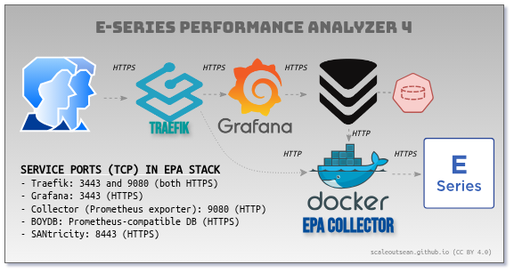

# NetApp E-Series Performance Analyzer ("EPA")

- [NetApp E-Series Performance Analyzer ("EPA")](#netapp-e-series-performance-analyzer-epa)
  - [What is EPA](#what-is-epa)
  - [Requirements](#requirements)
  - [Quick start](#quick-start)
    - [Use SANtricity `monitor` account](#use-santricity-monitor-account)
    - [Prometheus port](#prometheus-port)
  - [Containerized EPA](#containerized-epa)
    - [Build own Collector container](#build-own-collector-container)
    - [Pre-created Collector container](#pre-created-collector-container)
    - [Docker Compose service ports](#docker-compose-service-ports)
    - [CLI](#cli)
  - [Other documents](#other-documents)
  - [Change log](#change-log)

## What is EPA

EPA 4 builds upon EPA 3 while adopting ideas from [E-Series SANtricity Collector](https://github.com/scaleoutsean/eseries-santricity-collector).

EPA 4 is essentially **an opinionated Prometheus exporter** (or a solution stack, if provided 3rd party components are deployed together with it).



Each EPA Collector monitors one and only one SANtricity system using the lowest-privilege monitor account. Each storage administrator can spin their own and have metrics scraped by own or centralized Prometheus scraper.

You can find more about its positioning and direction in my [post about EPA 4](https://scaleoutsean.github.io/2026/04/23/epa_400_beta.html).

## Requirements

- NetApp E-Series SANtricity >=11.90
- Python >=3.12

## Quick start

**NOTE:** `master` branch may be ahead of Releases. You may download and decompress all EPA 4 and 3 releases from [Releases](https://github.com/scaleoutsean/eseries-perf-analyzer/releases).

| EPA version | Where to go |
| :---:   | :-----------|
| 4       | stay here   |
| 3       | [click here](https://github.com/scaleoutsean/eseries-perf-analyzer/tree/v3.5.4) |

### Use SANtricity `monitor` account

EPA Collector defaults to using SANtricity's built-in `monitor` account unless you override that in arguments or Compose.

It is suggested to just set a password for SANtricity account.

### Prometheus port

Start Collector and check Prometheus exporter on your EPA 4 host (`localhost` or other, with firewall allowing access).

Note that EPA Collector runs Prometheus exporter service on HTTP port **9080**. That can be changed in Compose or using Collector's Prometheus port option.

```sh
curl -v http://localhost:9080/metrics 2>&1 | grep -E "(Date:|Last-Modified:|< HTTP)"
```

If you run multiple instances of Collector on same system, VM or Compose stack, make sure each exposes a different external Prometheus port.

## Containerized EPA

Users are encouraged to run own Prometheus scraper and Grafana.

### Build own Collector container

```bash
TAG="v4.0.0beta2"
git clone --depth 1 --branch ${TAG} https://github.com/scaleoutsean/eseries-perf-analyzer/
cd eseries-perf-analyzer
cat ./scripts/SCRIPTS.md          # Read what these scripts do and how to use them
./scripts/gen_ca_tls_certs.py all # REQUIRED, unless you supply own TLS certificates
./scripts/setup-data-dirs.sh      # REQUIRED; creates data directories for Grafana, VM
make vendor                       # REQUIRED; downloads SANtricity client to epa/santricity_client
vim .env                          # optional, for Docker Compose Grafana version or non-default initial credentials
vim docker-compose.yml            # REQUIRED; you must provide correct SANtricity API IP/FQDN, credentials
```

Run Compose:

```sh
docker compose up -d
```

Note that `make`, TLS and data directories-generating scripts are mandatory for Docker Compose users without own Grafana or database.

### Pre-created Collector container

If you want to use pre-created GHCR containers rather than build own, set the right version with `:{TAG}` (`:4.0.0`, for example) and use the same for both `collector` and `grafana-init` image version:

- [grafana-init](https://github.com/scaleoutsean/eseries-perf-analyzer/pkgs/container/eseries-perf-analyzer%2Fgrafana-init) - this one just uploads reference dashboards to Grafana
- [collector](https://github.com/scaleoutsean/eseries-perf-analyzer/pkgs/container/eseries-perf-analyzer%2Fcollector)

You should use the same docker-compose.yml, just change these two images to use GHCR, provide a password for your `monitor` user on SANtricity and your E-Series management IP address. The rest (not shown) should be able to remain as-is.

```yaml
services:

  collector: 
    image: ghcr.io/scaleoutsean/eseries-perf-analyzer/collector:4.0.0beta2
    environment: 
      - PASSWORD=monitor123  # non-production pass, thank you very much
      - API=2.2.2.2          # your E-Series 
  grafana-init:
    image: ghcr.io/scaleoutsean/eseries-perf-analyzer/grafana-init:4.0.0beta2
```

### Docker Compose service ports

Service URLs (assuming access from `localhost`):

- Exposed: EPA Collector's Prometheus metrics at [http://localhost:9080/metrics](http://localhost:9080/metrics) - expose different ports if running multiple Collectors
- Exposed: Grafana at [https://localhost:3443](https://localhost:3443)
- **NOT** exposed: Victoria Metrics at [https://localhost:8428](https://localhost:8428) (it may be exposed by editing the Compose file)

For multiple E-Series systems, it's best to create multiple collector-only Docker Compose files, although you can have all of them in same place (but exposed Prometheus ports and container names must be different). And finally, you'd have to scrape each Prometheus metrics endpoint and start managing Victoria Metrics, either from the UI or API/CLI.

### CLI

This only runs EPA Collector which gathers data and shares them over HTTP on Prometheus port

```bash
TAG="v4.0.0beta2"
git clone --depth 1 --branch ${TAG} https://github.com/scaleoutsean/eseries-perf-analyzer/
cd eseries-perf-analyzer
make vendor                            # REQUIRED for Docker; downloads SANtricity client to epa/santricity_client directory
pip install -r ./epa/requirements.txt  # REQUIRED for CLI (requests library, Prometheus client), not for Docker
python3 ./epa/collector.py -h 
```

Using default username `monitor` and SANtricity Web UI at 2.2.2.2:

```sh
python3 ./epa/collector.py --api 2.2.2.2 --password monitor123 --prometheus-port 9080 --no-verify-ssl
```

Open the browser and navigate to http://localhost:9080/metrics to see if Collector is working.

## Other documents

- [SCRIPTS](./scripts/SCRIPTS.md) has more details on running the helper scripts
- [CONFIGURATION](./CONFIGURATION.md) has extra details about configuration workflow
- [SCREEENSHOTS](./SCREENSHOTS.md) has example screenshots and details about installing reference dashboards
- [FAQs](./FAQ.md) - mostly EPA 3-focused at the moment, it has some basic EPA 4-related content

## Change log

- 4.0.0beta2 (April 27, 2026)
  - **Breaking changes**: do not "upgrade" from EPA 3 - deploy version 4 alongside version 3 if you want to try EPA 4
  - Fix automated Grafana dashboard upload in `grafana-init`, update `graphana-client` dependency, which now supports Grafana 13
  - Set Grafana version to 13 in `./grafana/Dockerfile`
  - Exclude HDDs from SSD wear level metrics
  - Add Victoria Metrics "EPA" data source configuration to Grafana container
  - Add `Makefile` for easy SANtricity client library download and use newer SANtricity client library to work around bad SANtricty API response
  - Add missing, but required install steps to README, add SCRIPTS document
  - Add installation instructions for Docker Compose with pre-made GHCR images

- 4.0.0beta1 (April 26, 2026)
  - **Breaking changes**: EPA now provides Prometheus-only output with breaking changes compared to Prometheus output from EPA 3. Use any Prometheus-compatible scraper to scrape. EPA 3 users who want to keep data and dashboards from EPA 3 should not "upgrade". EPA 3 will be maintained for months and bugs fixed.
  - Collector's direct dependencies are down to three (Requests, Prometheus Client, SANtricity Client)
  - New feature: detailed collection of snapshots-related configuration and metrics
  - Removed features: MEL events (which belong to logging, not performance or even configuration monitoring)
  - Third party stack components: Docker Compose now includes Grafana 13 (and several reference dashboards which should work on v12 as well) and Victoria Metrics as reference Prometheus scraper and database

- 3.5.4 (April 6, 2026)
  - Upgrade Grafana from last v8 release to v12.4.1, update existing dashboards to work with v12
  - Minor update to InfluxDB (from 1.12.2 to 1.12.3) and requests library (2.33.1)
  - Collector Python base image update to `python:3.15.0a7-alpine3.23` (fewer base image vulnerabilities)
  - Test stack with SANtricity 12.00 and 11.95
  - Add `TLS_VERIFY` option to EPA collector and Docker Compose environment variables
  - Make Prometheus service port configurable
  - Parse ports from Fibre Channel host objects
  - Add SSD Flash Cache metrics and example dashboard
  - Collect snapshot and volume count, and repository volumes' total capacity
  - Bug fixes and improvements (better handling of unavailable metrics, drop repository volumes from volume collection, avoid duplicate upload of reference dashboards, re-fix SSD wear level stats (11.90 and 12.00, SAS and NVMe SSDs), initiator count, volume capacity)

- 3.5.3 (January 20, 2026)
  - Add Prometheus alerts for downed interfaces
  - Add optional "point-in-time" volume performance metrics (default: off) for use cases where default (rolling 5 minute average) is not enough. Enable with `--realtime`
  - Minor bug fixes and improvements (including GHCR container builds)

- 3.5.2 (October 8, 2025)
  - Update dependencies (container base image to 3.14-alpine3.22 and requests library v2.32.5)

- 3.5.1 (October 8, 2025)
  - Export unresolved system failures as Prometheus alerts
  - Upgrade InfluxDB to latest and greatest v1.12.2

- 3.5.0 (September 2, 2025)
  - Add several array configuration objects: hosts, volumes, disk groupings, drives. Now the monitoring of hardware configuration and - more importantly - disk group/pool and volume capacity should be easy. Existing EPA 3 users with tight DB disk space upgrading to 3.5.0+ should use `--include` and add `config_` collectors only gradually until they're sure their DB can handle it
  - InfluxDB: expose RPC service on Docker-internal network for convenient access from the utilities container
  - Collector: improve database down-sampling/pruning for records older than 30d. No real testing has been done (it'll take 31d to find out), but it's unlikely to be worse than in earlier releases. Still, 3.5.0+ collects a lot more with `config_` measurements added, so monitor the size of your `influxdb` volume in Docker
  - Add experimental Prometheus exporter (enabled by default; disable with `--output influxdb`). Docker Compose has Prometheus port closed by default
  - Grafana: sample dashboard for `config_` measurements added to /epa/grafana-init/dashboards/
  - Collector: add Prometheus client for export of only performance-related measurements. It is on by default, but can be disabled. When enabled, it requires open host firewall and/or expose Docker Compose port
  - Collector: various small improvements and small fixes discovered in testing  
  - Docker Compose: raise maximum InfluxDB RAM to 4GB (docker-compose.yaml) as EPA may need to handle more data
  - Docker Compose: "named" InfluxDB and Grafana volumes have been moved to directory-style volumes in the `epa` directory (although you can change that) because "named" didn't behave better
  
- 3.4.2 (August 29, 2025)
  - Change Docker Compose network type to `bridge` for automated setup/tear-down by Docker
  - Fix missing `--include <all-measurements>` resulted in nothing being collected
  - Add `--debug` switch to make troubleshooting bugs like the one with `--include` easier

- 3.4.1 (August 27, 2025)
  - Add volume group tag to physical disks (lets you filter disks by (RAID) group or (DPP) pool)
  - Add `--include <measurement>` for filtered writes to InfluxDB (non-included measurement(s) doesn't get written). Default: include everything

- 3.4.0 (August 24, 2025)
  - Remove `dbmanager` container and its JSON configuration file (one less container to worry about)
  - Add "create database" feature to Collector to replace `dbmanager`
  - Minor update of version tags for various images (InfluxDB, Python, Alpine)
  - Docker Compose with InfluxDB 1.11.8 necessitates `user` key addition and change to InfluxDB volume ownership
  - Complete removal of the pre-fork bloat (epa/Makefile, epa/ansible epa/blackduck and the rest of it)
  - Merge two docker-compose.yaml files into one (`epa/docker-compose.yaml`)
  - Add `grafana-init` container to replace what epa/ansible used to do in a more complicated way
  - Add `utils` container with InfluxDB v1 client for easy management of InfluxDB  
  - Remove "internal images" build feature that epa/Makefile was using - builds are now much faster and easier to maintain
  - Small error handling improvements in EPA Collector noted in Issues
  - Add checks and fixes for handling inconsistent API responses from SANtricity API that may have caused dropped inserts in InfluxDB in some situations
  - Multiple fixes related to built-in dashboards (Grafana data source set to `EPA`, `WSP` has been removed, dashboards can be imported without issues) 
  - Dashboards are now imported to "EPA" folder. Find them in Grafana with Dashboards > Browse
  - Remove direct import of `urllib3` and lets `requests` deal with it (and requests now defaults to v2.5.0). Prior versions of EPA use `urllib3` v1 which has minor vulnerability that doesn't impact EPA which connects to trusted SANtricity API endpoint over trusted network
  - See upgrade-related Q&A in the [FAQs](./FAQ.md). There are no new features and apart from the weak `urllib3` vulnerability there's no reason to install this if your EPA < 3.4.0 is running fine

- 3.3.1 (June 1, 2024):
  - Dependency update (requests library)

- 3.3.0 (April 15, 2024):
  - collector now collects *controller shelf*'s total power consumption metric (sum of PSUs' consumption) and temperature sensors' values 
  - Security-related updates of various components

- 3.2.0 (Jan 30, 2023):
  - No new features vs. v3.1.0
  - No changes to Grafana container, Grafana charts, and InfluxDB container
  - collector and dbmanager are now completely independent of containers built by InfluxDB and Grafana Makefile 
  - New Kubernetes folder with Kubernetes-related instructions and sample YAML files
  - collector and dbmanager can work on both AMD64 and ARM64 systems

- 3.1.0 (Jan 12, 2023):
  - No changes to Grafana dashboards
  - Updated Grafana v8 (8.5.15), Python Alpine image (3.10-alpine3.17) and certifi (2022.12.7)
  - Remove SANtricity Web Services Proxy (WSP) and remove WSP-related code from collector 
  - Make InfluxDB listen on public (external) IP address, so that collectors from remote locations can send data in
  - Add the ability to alternate between two E-Series controllers to collector (in upstream v3.0.0 the now-removed WSP would do that)
  - Add collection of SSD wear level for flash media (panel(s) haven't been added, it's up to the user to add them if they need 'em)
  - Expand the number of required arguments in `collector.py` to avoid unintentional mistakes
  - Collector can run in Kubernetes and Nomad
  - Add dbmanager container for the purpose of uploading array configuration to InfluxDB (and potentially other DB-related tasks down the road)
  - Add simple Makefile for collector containers (collector itself, and dbmanager)
  - Old unit tests are no longer maintained
