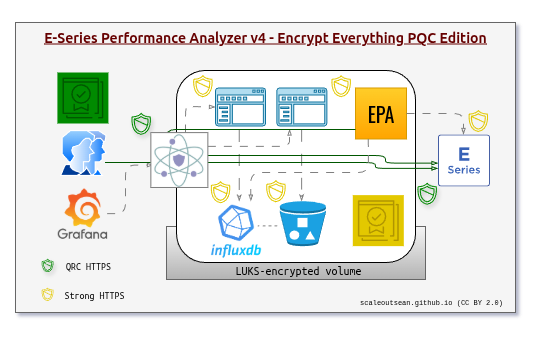

# README.md

- [README.md](#readmemd)
  - [What is E-Series Perf Analyzer (EPA)?](#what-is-e-series-perf-analyzer-epa)
  - [What EPA does](#what-epa-does)
  - [Minimum requirements](#minimum-requirements)
  - [Where and how to run it?](#where-and-how-to-run-it)
    - [CLI](#cli)
    - [Docker](#docker)
    - [Kubernetes](#kubernetes)
  - [Other resources](#other-resources)


## What is E-Series Perf Analyzer (EPA)?

EPA is a software stack for collection of metrics (and some other things) from NetApp E-Series storage systems. 

It uses SANtricity API to gather data points from storage array(s) and stores it in InfluxDB 3 for near-real-time analysis. 


This EPA was originally forked from the NetApp EPA 3 (now archived). Our version 3 releases fixed some bad ideas and eliminated most of the bloat. 

Version 4 is almost a complete re-write that continues in the same direction that our version 3 was going. 

## What EPA does

- Metrics collection and more
  - (Storage) system
  - Controllers
  - Interfaces
  - Volumes  
  - Disks (performance)
  - Disks (configuration/properties)
  - Power supplies (power consumption)  
  - Temperature (inlet, CPU)
  - Events and MEL (major event logs)
- Security not an afterthought
  - Out-of-the-box HTTPS everywhere
  - TLS 1.3 with strong ciphers
  - Strict TLS certificate validation available, and regular TLS validation by default (invalid certificates rejected)
  - Quantum-Resistant Cryptography option for TLS key exchange
  - Enables QRC proxying of SANtricity Web and API 
- Future-proof design
  - Database back-end on InfluxDB 3 released in 2025 - good for years to come
  - Python 3.10+ with InfluxDB3 client developed by InfluxDB community and no fancy modules
  - InfluxDB Explorer - Web UI for data exploration using SQL or Natural Language Processing/AI
  - Integration with InfluxDB MCP server possible
- No-nonsense project
  - Permissive MIT license
  - No Community Code of Conduct
  - No Contributor Agreement

Full EPA stack - delivered in a reference docker-compose.yaml - is the first solution for monitoring of NetApp storage arrays that delivers database storage tiering, AI/MCP and Post-Quantum encryption.

The stack has just two key services:

- EPA Collector
- InfluxDB 3 (with optional tiering to S3)


In the above diagram you can see EPA will normally run separately from the rest of the stack as (for example) InfluxDB has no reason to reach E-Series controllers.

This more busy version shows a slightly different take and dives deeper into security:

- Docker-internal (or Kubernetes) CA issues certificates (yellow shield) to EPA stack and optionally E-Series (CA = yellow square)
- Enterprise CA-signed certificate (green shield) should be issued for the reverse proxy and could be issued for E-Series as well. EPA Collector could access E-Series controllers via external-facing HTTPS proxy or directly as before


Although EPA doesn't use PQC to reverse-proxy E-Series' controllers (because they tend to live on a strictly controlled management network), it is possible to expose them through our front-end quantum-resistant proxy.

With enterprise CA-issued certificates you can get trusted, quantum-resistant HTTPS proxy that works end-to-end (PQC on front-end proxy with verified, strong TLS 1.3 to upstream SANtricity).



While others are still thinking about dashboards, EPA 4 has dropped dashboards (some reference dashboards will be provided) and is focusing on AI- and MCP-assisted exploration. 


1. Use SQL trigger sophisticated alerts directly from InfluxDB in real-time
2. Use Natural Language Processing to work out SQL with chatbot's help directly from InfluDB Explorer - just enter your access token for AI chatbot. InfluxDB has its official MCP server that can be added to EPA stack.

## Minimum requirements

EPA Collector needs Python 3.10+ and requires less than 100 MB RAM and 0.5 vCPU.

## Where and how to run it?

See [GETTING-STARTED](./GETTING-STARTED.md) for that, but here's a summary:

### CLI

If you don't use containers or want to use EPA for a short time, CLI is the way to go. Clone the repository (mind the branch of not cloning from `master`), install dependencies and you're good to go.

```sh
pip3 install -r app/requirements.txt
python3 -m app.collector -h
```

### Docker

TODO during 4.0.0 beta

### Kubernetes

TODO during 4.0.0 beta

## Other resources

- [DOCUMENTATION](./DOCUMENTATION.md)
- [FAQs](./FAQ.md)
- [CHANGELOG](./CHANGELOG.md)
