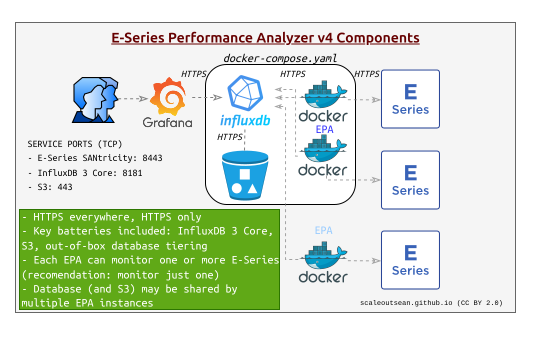

# README.md

- [README.md](#readmemd)
  - [What is E-Series Perf Analyzer (EPA)?](#what-is-e-series-perf-analyzer-epa)
  - [What EPA does](#what-epa-does)
  - [Minimum requirements](#minimum-requirements)
  - [Where and how to run EPA?](#where-and-how-to-run-epa)
    - [CLI](#cli)
    - [Docker](#docker)
    - [Kubernetes](#kubernetes)
  - [Other resources](#other-resources)


## What is E-Series Perf Analyzer (EPA)?

EPA is a software stack for collection of metrics (and some other things) from NetApp E-Series storage systems. 

It uses SANtricity API to gather data points from storage array(s) and stores it in InfluxDB 3 for near-real-time analysis. 



This EPA was originally forked from the NetApp EPA 3 (now archived). Our version 3 releases fixed some bad ideas and eliminated most of the bloat. 

Version 4 is almost a complete re-write that continues in the same direction that our version 3 was going. 

## What EPA does

- Metrics collection and more
  - System
  - Controllers
  - Interfaces
  - Volumes  
  - Disks (performance)
  - Disks (configuration/properties)
  - Power supplies (power consumption)  
  - Temperature (inlet, CPU)
  - Events and MEL (major event log)
- Security not an afterthought
  - Out-of-the-box HTTPS everywhere
  - TLS 1.3 with strong ciphers
  - Strict TLS certificate validation available, and regular TLS validation by default (invalid certificates rejected)
  - Quantum-Resistant Cryptography option for TLS key exchange
  - Enables Quantum-Resistant proxying of Web and API access to SANtricity API
- Future-proof design
  - Database back-end on InfluxDB 3 released in 2025 - good for years to come
  - Python 3.10+ with InfluxDB3 client developed by InfluxDB community and only the essential modules
  - InfluxDB Explorer - Web UI for data exploration using SQL or Natural Language Processing/AI
  - External reverse HTTPS proxy for easy access by InfluxDB 3 MCP Server or other authorized clients
- Agility and simplicity
  - Permissive MIT license
  - No Community Code of Conduct
  - No Contributor Agreement

Full EPA stack - delivered in a reference docker-compose.yaml - is the first solution for monitoring of NetApp storage arrays that delivers database storage tiering, AI/MCP and Post-Quantum encryption.

The stack has just two key services:

- EPA Collector
- InfluxDB 3 (with optional tiering to S3)


EPA Collector can run separately from the rest of the EPA stack as (for example) InfluxDB has no reason to connect to E-Series controllers on management LAN. 

This more busy version shows a slightly different take and dives deeper into CA and TLS certificates:

- Docker-internal (or Kubernetes) CA issues certificates (yellow shield) to EPA stack services and optionally E-Series (CA = yellow square)
- Enterprise CA-signed certificates (green shields) may be issued for the reverse HTTPS proxy and E-Series as well. EPA Collector could then access E-Series controllers via external-facing HTTPS proxy or directly as before


Although EPA doesn't use PQC to reverse-proxy E-Series' controllers (because they tend to live on a strictly controlled management network), it is possible to expose them through our front-end quantum-resistant HTTPS proxy.

With enterprise CA-issued certificates you can get trusted, quantum-resistant HTTPS proxy that works end-to-end (PQC on front-end proxy with verified, strong TLS 1.3 to upstream SANtricity) and is usable for secure access to other EPA stack services such as InfluxDB or InfluxDB explorer.


Aside from focus on access security, the other major focus this release is AI.

EPA 4 has dropped dashboards as a low value-added component (although a basic dashboard will be provided) and even Grafana is drawn as an external service in EPA stack diagrams above. EPA v4 aims to provide easy access to AI- and MCP-assisted analysis and alerting. How?

1. Use built-in SQL triggers to create sophisticated alerts directly from InfluxDB in real-time using InfluxDB 3 plugins
2. Use Natural Language Processing to create SQL queries in InfluxDB Explorer and export them to Grafana or use such queries to create built-in InfluxDB 3 alerts and data pipeline jobs. 
3. Thanks to our secure, external-facing HTTPS proxy, InfluxDB 3 core is also ready for access by InfluxDB MCP server (more in [DOCUMENTATION](./DOCUMENTATION.md))

## Minimum requirements

EPA Collector needs Python 3.10+ and requires less than 100 MB RAM and 0.5 vCPU.

If you want to store data in InfluxDB, you need an instance of InfluxDB 3 and a way to connect to it from EPA Collector.

## Where and how to run EPA?

See [GETTING-STARTED](./GETTING-STARTED.md) for that, but here's a summary of options:

### CLI

If you don't use containers or want to use EPA for a limited time, CLI is the way to go. Clone the repository (mind the branch if not cloning from `master`!), install dependencies and you're good to go.

```sh
# git clone ...
cd eseries-perf-analyzer/app
# create virtual environment in ./app/
pip3 install -r requirements.txt
cd ..
python3 -m app.collector -h
```

Note that this makes it possible to run EPA Collector, while the rest of the stack is an exercise for the user. You could install the rest in Docker (disable or remove `collector` service, and start `influxdb` and `influxdb-init`, for example) and have EPA Collector send data to it via the external-facing secure proxy.

### Docker

TODO during 4.0.0 beta

### Kubernetes

TODO during 4.0.0 beta

## Other resources

- [DOCUMENTATION](./DOCUMENTATION.md)
- [TIPS](./TIPS.md)
- [FAQs](./FAQ.md)
- [CHANGELOG](./CHANGELOG.md)
