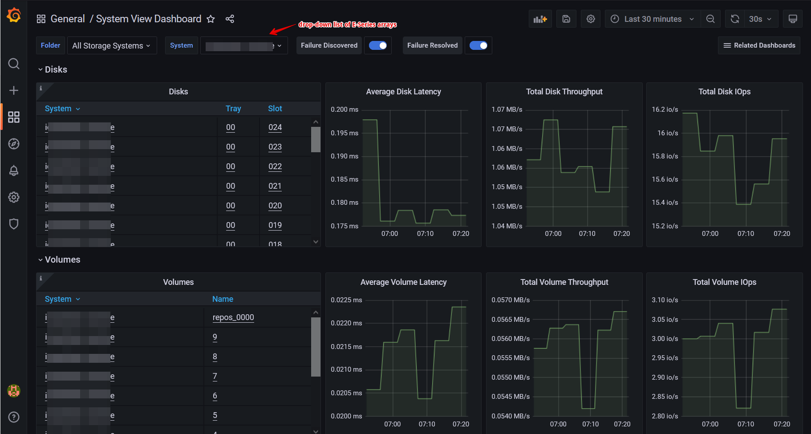
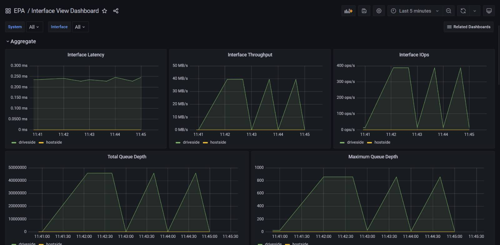
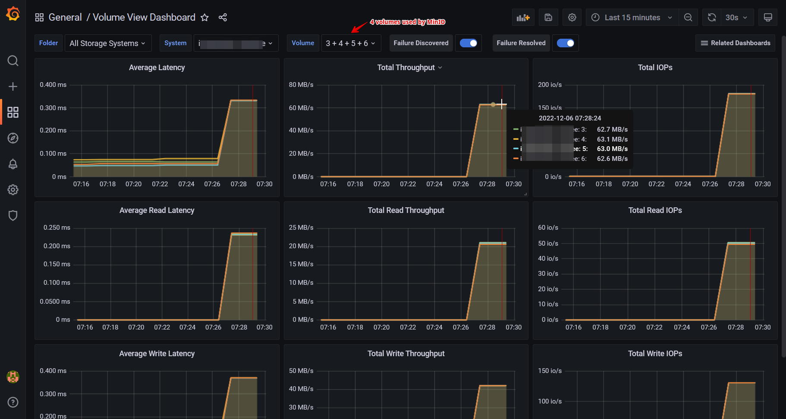
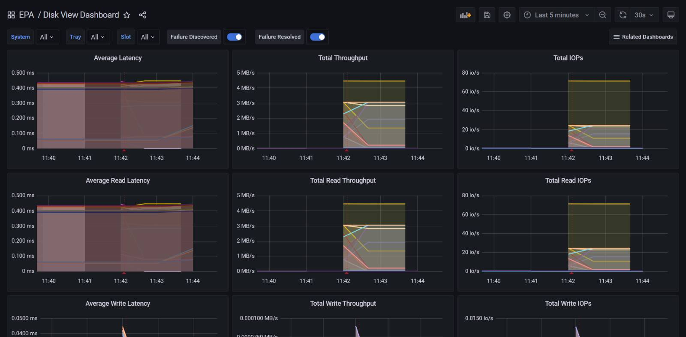
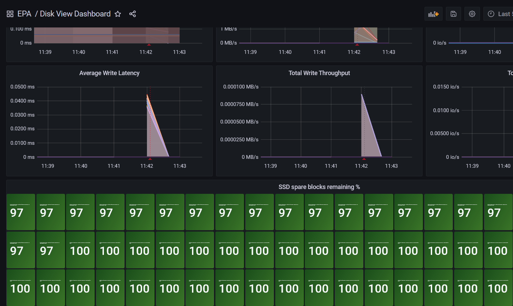
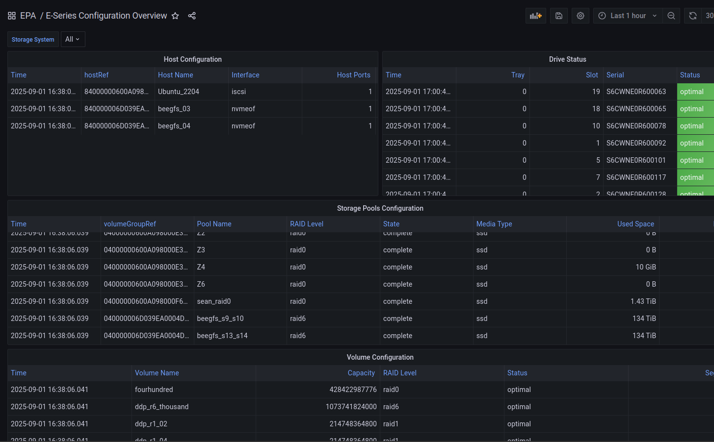
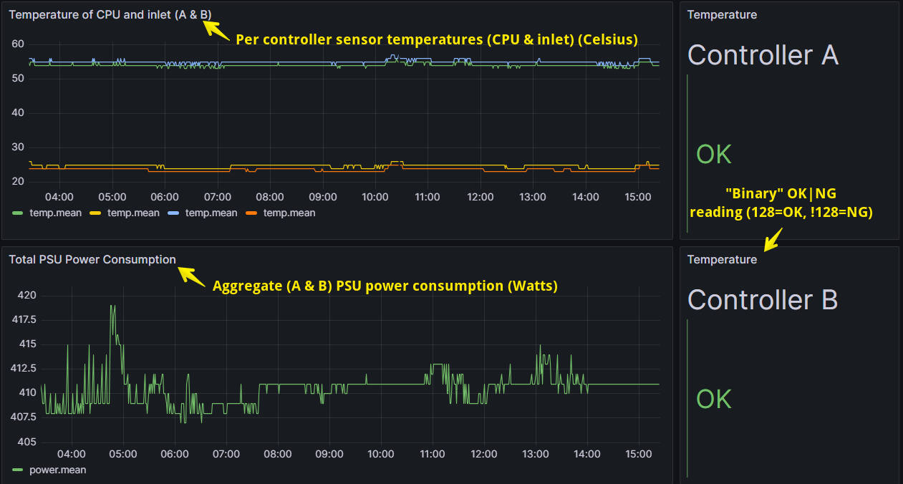

# EPA Screenshots

As you can see in `./epa/grafana-init/dashboards/`, there are several sample dashboards which may be manually imported or uploaded to the included Grafana instance with `grafana-init`.

- **System**

- **Interfaces**

- **Volumes** 

- **Disks** (top) 

- **Disks** (bottom) - basic SSD life remaining visualization shows disks from two systems, one of which is older and its disks aren't at 100%

- **Configuration**

- **Environmental** (a version of this panel is included in one of the dashboard files)

