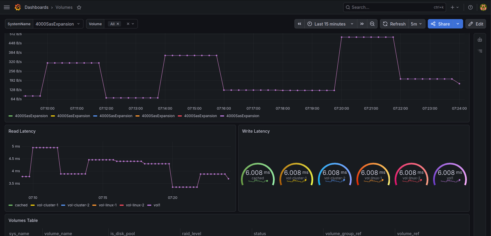
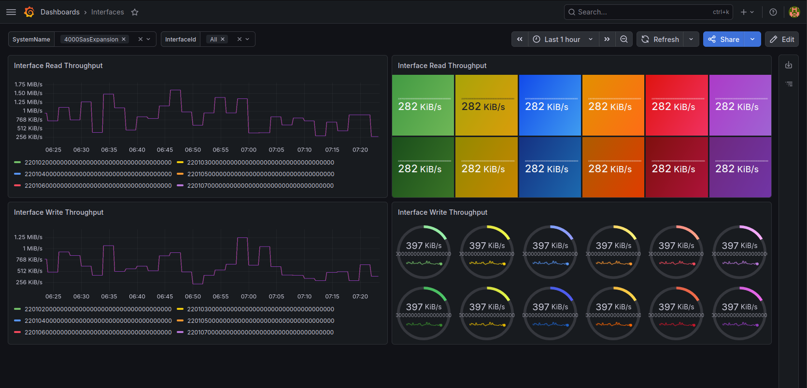
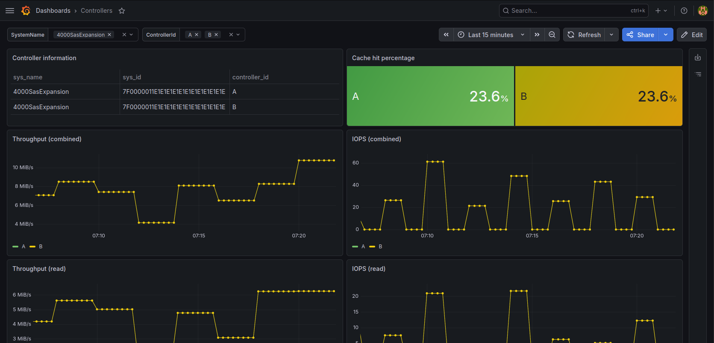
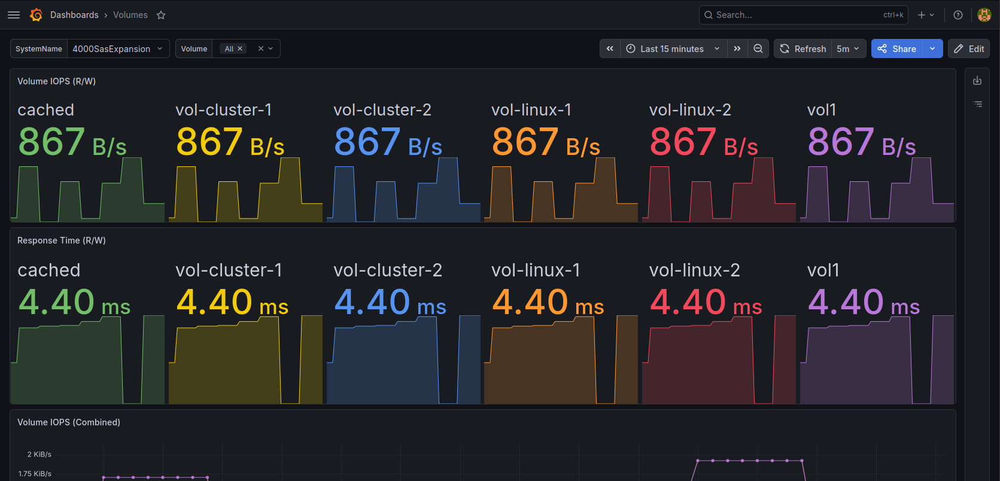
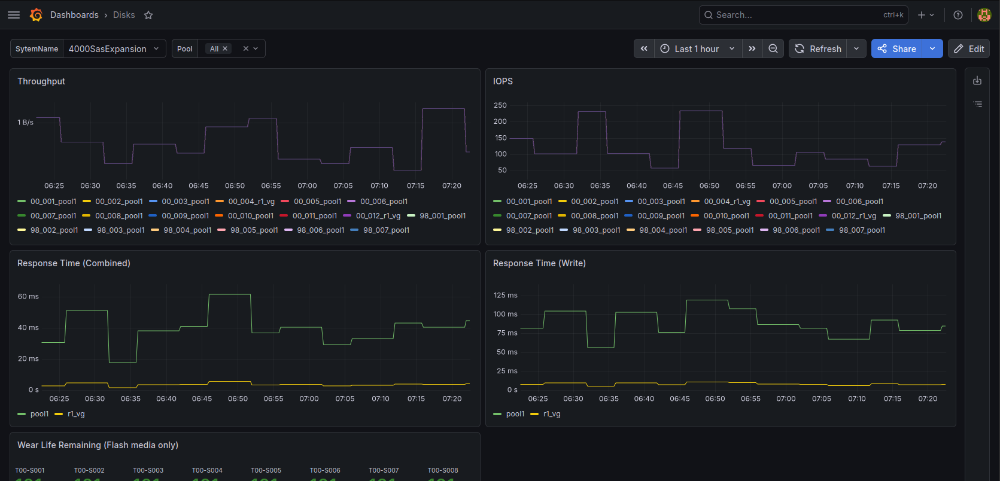
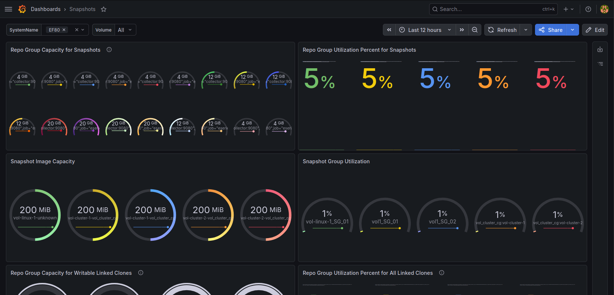
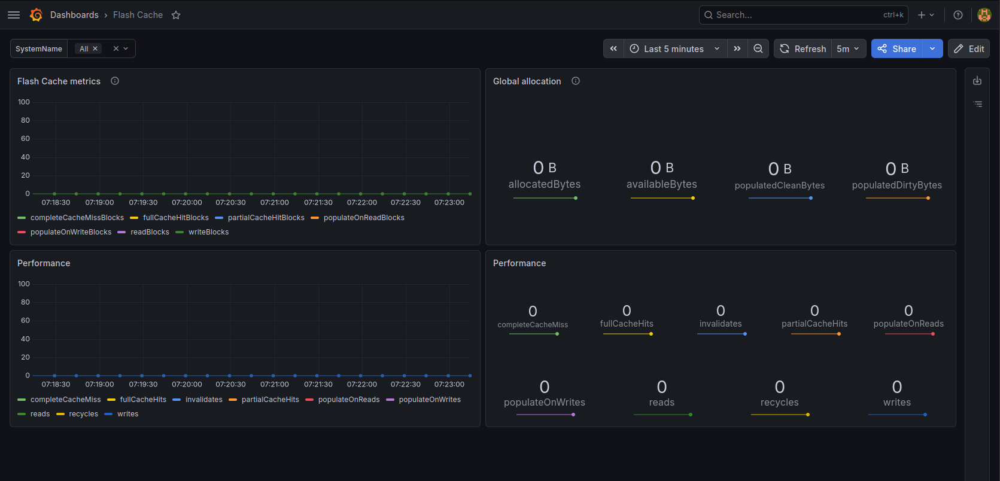
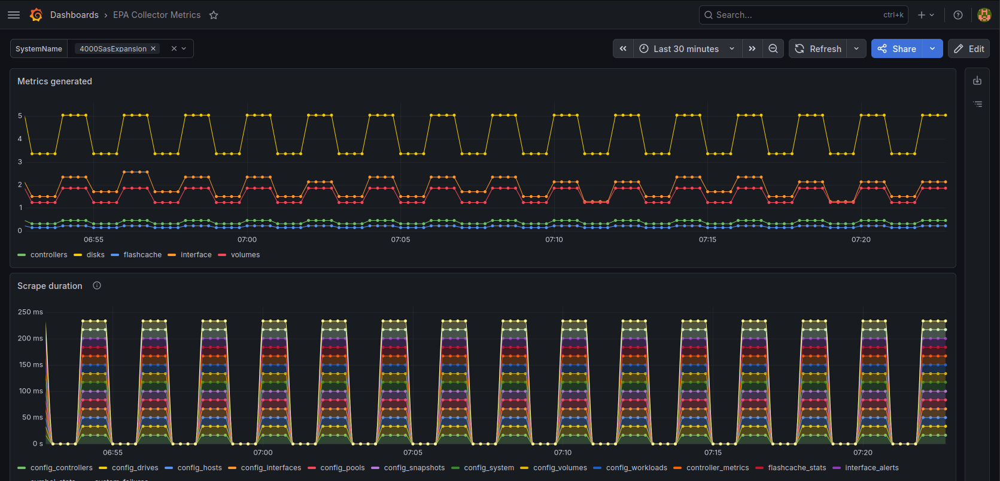

# Screenshots

These exist to demonstrate that metrics as well as basic configuration details are available.

How to install dashboards:

- Default EPA stack (with Victoria Metrics): run `docker compose up grafana-init` or manually import dashboard files from `./grafana-init/dashboards/`
- Grafana set up for a Prometheus-compatible data source: manually import dashboards from `./grafana-init/dashboards/`, they should work with standard Prometheus data sources. If you notice any Victoria Metrics-specific issues, try creating a similar panel using generic Prometheus source

The Overview dashboard shows an example of a configuration table, with top-down time series, gauges and so on.

At the bottom there are two more tables, of which only one is barely visible due to fixed screenshot positioning.

SANtricity interfaces have no names and use these ugly IDs. Those can be easily aliased (e.g. `C1P2`), but you have to do it on your own since there are many possible interface types, configurations and ways to configure HICs on E-Series.

Controllers have details like CPU utilization, throughput and IOPS. They also use ugly IDs, but unlike interfaces, it's always just one or two and so they've been pre-aliased to `A` and `B`.

Volumes use live metrics which SANtricity exposes as "rate" metrics and EPA collector adjusts to "per second" rates for you.

Disks have similar metrics (performance) and various configuration details. You can pick own aliasing method, of course. Some of these use `TRAY_SLOT_POOLNAME`, or `TRAY_SLOT` further below.

Unlike the SANtricity UI, EPA Collector lets you get all Snapshot and Linked Clone-related details in one place.

Repository group size, snapshot "group" (not really a group), snapshot count, linked clone count, repository group utilization, and more.

If - and only if - you have a hybrid SANtricity box with two media types **and** have created Flash Cache and enabled it on at least one volume, you may be able to use these.

These are just for checking if EPA is working. They're basic now, but may improve in the future.

