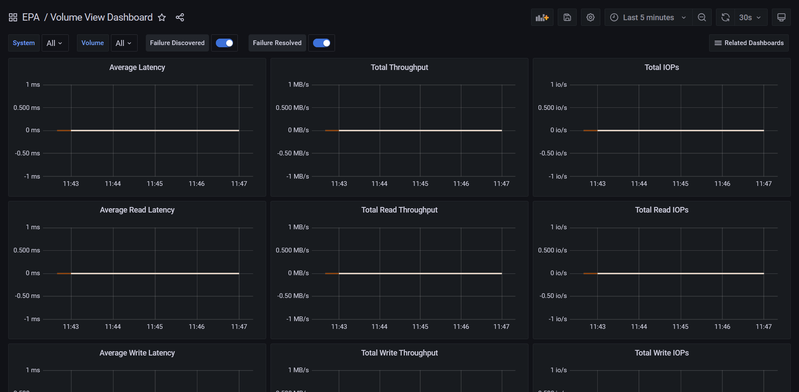

# EPA Screenshots

As you can see in `./epa/grafana-init/dashboards/`, there are four dashboards. The last one shown was created at some point but I didn't keep it, so you'd have to add a panel or dashboard to visualize those measurements. Configuration dashboard is new in 3.5.0 and is supposed to use higher time granularity because configuration data is collected on a 15 minute schedule (by default).

- **System**

- **Interfaces**

- **Volumes** 

- **Disks** (top) 

- **Disks** (bottom) - basic SSD life remaining visualization shows disks from two systems, one of which is older and its disks aren't at 100%

- **Configuration**

- **Environmental** (not included)

