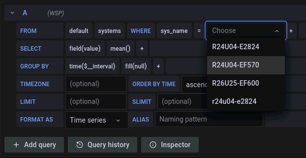

# Deploy EPA dbmanager and collector(s)


- [Deploy EPA dbmanager and collector(s)](#deploy-epa-dbmanager-and-collectors)
  - [Assumptions](#assumptions)
  - [Deployment decisions](#deployment-decisions)
  - [Create a namespace and deploy InfluxDB and Grafana](#create-a-namespace-and-deploy-influxdb-and-grafana)
    - [Create a namespace](#create-a-namespace)
    - [Deploy InfluxDB version 1 and Grafana version 8](#deploy-influxdb-version-1-and-grafana-version-8)
  - [Prepare configuration files and deploy EPA dbmanager and collector](#prepare-configuration-files-and-deploy-epa-dbmanager-and-collector)
    - [dbmanager](#dbmanager)
    - [collector(s)](#collectors)
  - [Result](#result)
  - [Common mistakes](#common-mistakes)
  - [Summary](#summary)

If you'd prefer to watch a 3 minute deployment video rather than read a lot of text, see it [here](samples/README.md#video-demo).

## Assumptions

- Recent Kubernetes such as v1.25
- EPA v3.3.0 (InfluxDB v1, Grafana v8, SANtricity OS 11.8)
- CSI plugin for persistent volumes
- Existing InfluxDB, Grafana in the same namespace used for monitoring: `epa`

## Deployment decisions

In their current form dbmanager and collector don't use any service ports, TLS certificates and such. They can run in the same namespace as InfluxDB (and Grafana).

The main thing to decide is where to run collectors: in the same namespace, in the same Kubernetes cluster, or externally and closer to each E-Series array (in which case InfluxDB 8086/tcp must be exposed at `EXTERNAL-IP` and (should be) secured by firewall rules).

Another concern is whether you want to encrypt the monitor account password (used by collector). If the SANtricity (read-only) monitor account is used, the consequence of its password being exposed is that someone could see your E-Series metrics, capacity and such - in other words, very limited impact. Additionally, each collector can run in a different location, be secured by respective E-Series "owner", and use a different password. The risk is low and that's why collector still stores credentials in deployment's ENV variables. But collector deployment YAML can be modified and password stored elsewhere similarly to what we do for InfluxDB.

## Create a namespace and deploy InfluxDB and Grafana

### Create a namespace

Examples and YAML files use the `epa` namespace. Many how-to's seem to standardize on `monitoring`, but you may have production monitoring applications there so I use `epa` instead. Use the right namespace for *your* environment. If you don't have a namespace, you can create one:

```sh
kubectl create namespace epa
```

### Deploy InfluxDB version 1 and Grafana version 8

You may deploy InfluxDB v1 (v1.8, for example) and Grafana version 8 any way you want. Just make sure that:

- InfluxDB is reachable by collector and dbmanager containers, and by Grafana container
- Grafana is reachable by your browser

You can find plenty of details about these deployments and services in the [samples](samples/README.md) directory, but the configuration of these services is out of scope here - please use community guides or the official documentation to figure it out.

Even if you know how to deploy Grafana, pay attention to that README file in the samples directory because it shows how to create data source and import EPA dashboards (which have the data source name hard-coded). If you want to create own dashboards or import EPA dashboards on your own, then you can skip it.

## Prepare configuration files and deploy EPA dbmanager and collector 

This covers only dbmanager and collector. 

The YAML samples in here are set to use ready-made imags from Docker Hub, e.g. docker.io/scaleoutsean/epa-collector:v3.2.0. These may be downloaded and uploaded to your own registry, but you can also build your own:

```sh
git clone https://github.com/scaleoutsean/eseries-perf-analyzer/
cd eseries-perf-analyzer/collector
docker-compose build             # prefix with "sudo " if need be
```

Using collector image as an example, image location in YAML file needs to be edited if you don't want to use Docker Hub:

|Approach      |Image location (example)|
|:-------------|:-------------|
|Local build   | epa/collector:v3.2.0                           |
|Docker Hub    | docker.io/scaleoutsean/epa-collector:v3.2.0    |
|Local registry| reg.istry.local/myaccount/epa-collector:latest |

Go to `./collector/kubernetes` and make appropriate image source (and other) changes to all YAML files.

### dbmanager

The role of this pod is to periodically send a list of E-Series array names (`SYSNAME` list) to InfluxDB, so that EPA dashboards can show these names in a drop-down list.

To deploy, edit `01-epa-dbmanager.yaml` in at least the following places:

- Array names in the JSON section (you can have just one, or more than two):

```json
  config.json: |
    {
        "storage_systems": [
            {
                "name": "R26U25-EF600"
            },
            {
                "name": "R24U04-E2824"
            }
        ]
    }
```

- InfluxDB IPv4 address or host name (can be as simple as `influxdb` if dbmanager will be running in the same namespace as InfluxDB):

```yaml
          env:
            - name: DB_ADDRESS
              value: 7.7.7.7
```

- Optionally edit container image source as explained earlier

|Approach      |Image location (example)|
|:-------------|:-------------|
|Local build   | epa/dbmanager:v3.2.0                           |
|Docker Hub    | docker.io/scaleoutsean/epa-dbmanager:v3.2.0    |
|Local registry| reg.istry.local/myaccount/epa-dbmanager:latest |

When that's all done, deploy it in the namespace of your choosing:

```sh
kubectl -n epa apply -f 01-epa-dbmanager.yaml
```

### collector(s)

Because the JSON example above uses two arrays, two sample YAML files (02 and 03) are provided because each array uses its own collector. 

Change at least the following:

- Enter your SANtricity API endpoint IPv4 (`API`; port 8443 is assumed), a `SYSNAME` that should match the name from dbmanager config.json (see above), `SYSID` which is WWN for the array (see the [main README](../README.md)), and username/password pair for the SANtricity API user (best use the `monitor` account because that one is read-only). Use the same `DB_ADDRESS` for dbmanager and all collectors

```yaml
data:
  API: "5.5.5.5"
  SYSNAME: "R26U25-EF600" # note uppercase letters, consistent with dbmanager
  SYSID: "600A098000F63714000000005E791234"
  DB_ADDRESS: "7.7.7.7"
  PASSWORD: "monitor123"
  USERNAME: "monitor"
```

- In all places where `r26u25-ef600` appears (container names and whatnot), search & replace that string with your `SYSNAME`, so that you can tell one collector container from another.

- Change the image source if you don't want to use the one from Docker Hub

Then deploy each configuration file, or just one if you have one array: 

```sh
kubectl -n epa apply -f 02-epa-collector-EF600.yaml
kubectl -n epa apply -f 03-epa-collector-E2824.yaml
```

## Result

One InfluxDB, one Grafana, one dbmanager and one or more collectors:

```sh
kubectl -n epa get pods
# NAME                                      READY   STATUS    RESTARTS   AGE
# dbmanager-5b5b6945c8-zpf64                1/1     Running   0          45s
# collector-r24u04-e2824-5ffd5886-tmnpl     1/1     Running   0          4s
# collector-r26u25-ef600-74c67fc88d-qzbv5   1/1     Running   0          22s
# grafana-8966fdf6b-2kxnv                   1/1     Running   0          3h58m
# influxdb-f4bb6575d-z44wt                  1/1     Running   0          176m
```

Go to Grafana > Explore to see if InfluxDB database is available to Grafana, which would assure us that collector, InfluxDB and Grafana data source are working correctly.


## Common mistakes

If you have a problem, it's probably due to using a wrong namespace or typos in one of the YAML files.

Here's an example of what happens when dbmanager's `config.json` uses uppercase, and `SYSNAME` in collector uses lowercase array names: data is collected and delivered to InfluxDB, but not visible in EPA dashboards.



The result is Grafana > Explore (screenshot) shows the "same" name twice (lowercase and uppercase), but the dashboards don't show `r24u04-e2824` (which collector gathers based on its configuration) in dashboards' drop-down menu. Instead they show `R24U04-E2824`, because dbmanager's `config.json` is configured to create `SYSNAME`s using uppercase.

This can be fixed by deleting one of the deployments (either dbmanager or collector) and editing YAML file to make the names consistent.

collector and dbmanager pods can be observed the usual way:

```sh
kubectl -n epa logs dbmanager-5b5b6945c8-zpf64
# 2023-01-13 13:51:11,491 - collector - INFO - Reading config.json...
# 2023-01-13 13:51:11,501 - collector - INFO - Uploading folders to InfluxDB: [{'measurement': 'folders', 'tags': {'folder_name': 'All Storage Systems', 'sys_name': 'R26U25-EF600'}, 'fields': {'dummy': 0}}, {'measurement': 'folders', 'tags': {'folder_name': 'All Storage Systems', 'sys_name': 'R24U04-E2824'}, 'fields': {'dummy': 0}}]
# 2023-01-13 13:51:11,545 - collector - INFO - Update loop evaluation complete, awaiting next run...
# 2023-01-13 13:51:11,545 - collector - INFO - Time interval: 300.0000 Time to collect and send: 00.0538 Iteration: 1
```

## Summary

In this section the following was deployed:

- dbmanager, which pushes a list of arrays to InfluxDB
- pair of collectors that gather metrics and events from two E-Series arrays and send them to InfluxDB

