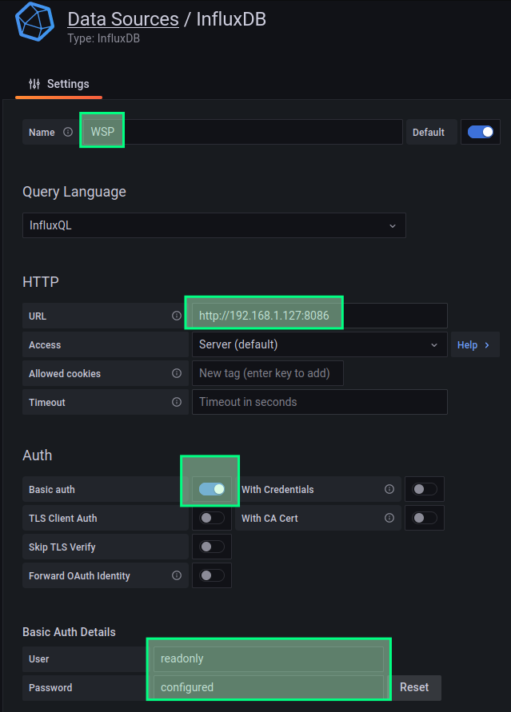
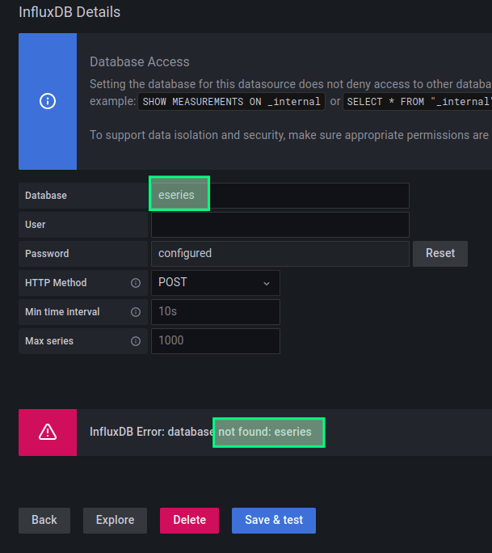
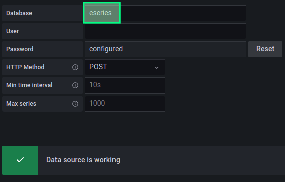
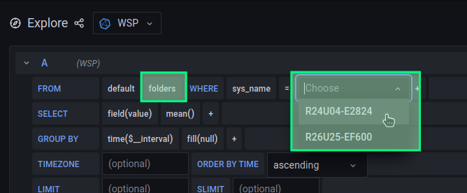
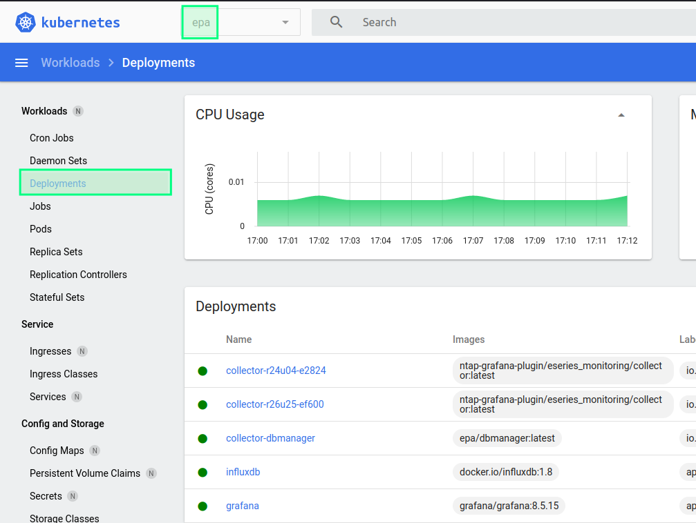

## E-Series Performance Analyzer on Kubernetes


- [E-Series Performance Analyzer on Kubernetes](#e-series-performance-analyzer-on-kubernetes)
  - [Create namespace](#create-namespace)
  - [InfluxDB v1](#influxdb-v1)
  - [collector and dbmanager](#collector-and-dbmanager)
  - [Grafana v8](#grafana-v8)
    - [Automatically deploy InfluxDB data source and Grafana dashboards](#automatically-deploy-influxdb-data-source-and-grafana-dashboards)
      - [Run Ansible playbook in the same Kubernetes namespace as InfluxDB and Grafana](#run-ansible-playbook-in-the-same-kubernetes-namespace-as-influxdb-and-grafana)
      - [Run Ansible playbook from client, VM or other location](#run-ansible-playbook-from-client-vm-or-other-location)
    - [Manually add InfluxDB as Grafana Data Source](#manually-add-influxdb-as-grafana-data-source)
    - [Manually import Grafana dashboards](#manually-import-grafana-dashboards)
    - [Other ways to provision Grafana data sources and dashboards](#other-ways-to-provision-grafana-data-sources-and-dashboards)
  - [Wrap-up](#wrap-up)
  - [Video demo](#video-demo)


Assumptions:

- Kubernetes v1.25
- EPA v3.1.0 (InfluxDB v1, Grafana v8, SANtricity OS 11.7)
- CSI plugin for persistent volumes
- InfluxDB, collectors, dbmanager and Grafana in the same namespace, `epa`

### Create namespace

Examples and YAML files use the `epa` namespace. Many seem to standardize on `monitoring`, but you may have production monitoring applications there, so I use `epa` instead.

Search & replace `namespace: epa` in the provided YAML files to use a different namespace.

```sh
kubectl create namespace epa
# "lock" kubectl to this namespace
kubectl config set-context --current --namespace=epa
```

### InfluxDB v1

EPA v3.1.0 uses InvluxDB v1.

Port 8086/tcp is used for client connections and should be open to all *external* collector and dbmanager clients as well as Grafana (if it's external). 

Collector does not use authentication, so either create firewall rules to allow only external collector by IP, or run collector in the same namespace as InfluxDB to eliminate the need for external access to InfluxDB.

This walk-through doesn't run external collectors, so it wasn't necessary to allow external access. But I did try it for Grafana, and it worked.

One, two or three PVs (in increasing order of resilience) may be used for InfluxDB storage.

According to [the official documentation for v1.8](https://docs.influxdata.com/influxdb/v1.8/concepts/file-system-layout/?t=Kubernetes#kubernetes-default-paths), data paths are as follows:

- Data: /var/lib/influxdb/data/
- WAL:  /var/lib/influxdb/wal/
- Metastore: /var/lib/influxdb/meta/

Filesystem overview:

```raw
/var/lib/influxdb/
                  data/
                        TSM directories and files
                  wal/
                        WAL directories and files
                  meta/
                        meta.db
```

Permissions:

```raw
.../influxdb/       755
.../influxdb/data/  755
.../influxdb/meta/  755
.../influxdb/wal/   700
```

Configuration options for InfluxDB may be viewed [here](https://docs.influxdata.com/influxdb/v1.8/introduction/install/).

InfluxDB secrets can be complex or simple depending on needs. EPA collector has never used authentication (because it used to runs on the same network as InfluxDB), so we cannot simply create INFLUXDB_USER (that's why it's marked-out) without modifying collector and dbmanager scripts to add authentication. 

If you cannot modify collector and dbmanger, create proper firewall rules for InfluxDB external IP, or run collector(s) and dbmanger in the same namespace.

`influxdb.yaml` contains service configuration that listens on port 8086/tcp. Remove that if there's no or modify it as you please.

```yml 
cd ./epa; make build

kubectl create secret generic influxdb-creds \
  --from-literal=INFLUXDB_DB=eseries \
  --from-literal=INFLUXDB_READ_USER=grafana \
  --from-literal=INFLUXDB_READ_USER_PASSWORD=grafana123readonlyUSER \
  --from-literal=INFLUXDB_ADMIN_USER=root \
  --from-literal=INFLUXDB_ADMIN_USER_PASSWORD=NetApp123 \
  --from-literal=INFLUXDB_HOST=influxdb  \
  --from-literal=INFLUXDB_HTTP_AUTH_ENABLED=false \
  # --from-literal=INFLUXDB_USER=monitor \
  # --from-literal=INFLUXDB_USER_PASSWORD=monitor123collector01 \

kubectl apply -f influxdb.yaml 
# persistentvolumeclaim/influxdb-data-pvc created
# persistentvolumeclaim/influxdb-wal-pvc created
# persistentvolumeclaim/influxdb-meta-pvc created
# deployment.apps/influxdb created
# service/influxdb created

kubectl get services
# NAME       TYPE           CLUSTER-IP      EXTERNAL-IP   PORT(S)          AGE
# influxdb   LoadBalancer   10.109.24.223   <pending>     8086:32328/TCP   37s
```

`EXTERNAL-IP` is missing, but you need it if either Grafana or collector or dbmanager will run elsewhere.

### collector and dbmanager

In their current form these containers don't need any service ports, TLS certificates and such. They can run in the same namespace as InfluxDB.

Things to decide:

- where to keep the monitor account password. Collector needs read-only access E-Series, so having it in YAML file is fine, but you can rework YAML files to store passwords in Kubernetes secrets
- where to run collectors: in the same namespace, in the same Kubernetes cluster, or externally and close to E-Series arrays (in which case InfluxDB 8086/tcp must be exposed at `EXTERNAL-IP` and (should be) secured by firewall rules)

To build and deploy these containers:

- go to `./collector`, edit `config.json` and run `make build` to build containers
  - upload container images to all worker nodes or to a container registry
- edit provided `dbmanager*.yaml` and `collector*.yaml` to tell Kubernetes where to get the container image (internal registry, etc.)
- for each E-Series system, make a copy of the sample collector YAML file and create a per-array YAML file with the correct values for `SYSNAME` and other parameters. Note that just like when we run EPA using docker-compose, when collector runs in the same namespace as InfluxDB `DB_ADDRESS` can be `influxdb` rather than external IP.

```sh
# one collector per each E-Series array
cp collector-collector-sample.yml collector-${SYSNAME}.yml
vim collector-${SYSNAME}.yml
kubectl apply -f collector-${SYSNAME}.yaml

# one dbmanager per each InfluxDB database
kubectl apply -f collector-dbmanager.yaml
```

dbmanager creates tags in InfluxDB's eseries database. These help EPA's ready-made Grafana dashboards show arrays in a drop down list. dbmanager can be started before or after collector(s). 

We need just one dbmanager container per InfluxDB, so we can run it in the same namespace as InfluxDB.

```sh
kubectl get pods
# NAME                                      READY   STATUS    RESTARTS   AGE
# collector-dbmanager-5b5b6945c8-zpf64      1/1     Running   0          45s
# collector-r24u04-e2824-5ffd5886-tmnpl     1/1     Running   0          4s
# collector-r26u25-ef600-74c67fc88d-qzbv5   1/1     Running   0          22s
# grafana-8966fdf6b-2kxnv                   1/1     Running   0          3h58m
# influxdb-f4bb6575d-z44wt                  1/1     Running   0          176m
```

Observe container logs to see if there are any issues. Collector and dbmanager should be sending data to InfluxDB. I don't have any E-Series on my network, so I will use dbmanager.

dbmanager in v3.1.0 works without E-Series storage present because all it does is read config.json and push the array names to InfluxDB. Let's see:

```sh
kubectl logs collector-dbmanager-5b5b6945c8-zpf64
# 2023-01-13 13:51:11,491 - collector - INFO - Reading config.json...
# 2023-01-13 13:51:11,501 - collector - INFO - Uploading folders to InfluxDB: [{'measurement': 'folders', 'tags': {'folder_name': 'All Storage Systems', 'sys_name': 'R26U25-EF600'}, 'fields': {'dummy': 0}}, {'measurement': 'folders', 'tags': {'folder_name': 'All Storage Systems', 'sys_name': 'R24U04-E2824'}, 'fields': {'dummy': 0}}]
# 2023-01-13 13:51:11,545 - collector - INFO - Update loop evaluation complete, awaiting next run...
# 2023-01-13 13:51:11,545 - collector - INFO - Time interval: 300.0000 Time to collect and send: 00.0538 Iteration: 1
```

We can now use Grafana > Explore to see if this data is in there.

### Grafana v8

Grafana can be deployed two ways:

- Use official Grafana instructions and container
- Use EPA Grafana container

EPA Grafana is the same as official Grafana OSS, but it includes the config file `./epa/grafana/grafana.ini`, so if you want to customize that file for your Grafana (to remove "phone home", for example), edit that file and from `./epa` run `make build`. Remember to use the resulting image in `grafana.yaml`.

If you want to use official image, see [the official instructions](https://grafana.com/docs/grafana/latest/setup-grafana/installation/kubernetes/) or [one](https://medium.com/starschema-blog/monitor-your-infrastructure-with-influxdb-and-grafana-on-kubernetes-a299a0afe3d2) [of](https://iceburn.medium.com/build-from-scratch-grafana-and-prometheus-on-minikube-228d4e9cfda0) the many community guides for version 8.

In both cases default credentials are the same: admin/admin can be used to log in.

In production, Grafana service would be behind a reverse proxy. There are too many ways to do that and that's out of scope here, so I'll just assume this was done the way you want it. Feel free to modify grafana.yaml if you can't find any better examples.

```sh
kubectl apply -f grafana.yaml

kubectl get services
# NAME       TYPE           CLUSTER-IP      EXTERNAL-IP   PORT(S)          AGE
# grafana    LoadBalancer   10.108.183.87   <pending>     3000:30104/TCP   46m
# influxdb   LoadBalancer   10.109.24.223   <pending>     8086:32328/TCP   37s
```

Like with InfluxDB, you need `EXTERNAL-IP` or port forwarding if you want to connect from the outside world.

With Grafana ready, we can add a InfluxDB v1 data source. There are 4-5 ways to do that. Let's start with the same approach used in EPA: Ansible.

#### Automatically deploy InfluxDB data source and Grafana dashboards

We can reuse Ansible from EPA here, but the Ansible playbook was done for Docker Compose and we need it to work with Kubernetes. There are two ways:

- run EPA Ansible container in InfluxDB/Grafana namespace (if these share namespace) - no changes to Ansible YAML files required
- run Ansible from Docker (EPA Ansible image) or OS shell (Ansible must be installed) anywhere where you can reach `EXTERNAL-IP` - public IPs for InfluxDB and Grafana are required here, so search & replace in Ansible YAML files is also required

Both approaches work the same as they do in EPA with Docker Compose: Ansible configures the default Data Source ("WSP"), adds another Data Source for internal InfluxDB metrics, and deploys the dashboards (four for E-Series, one for InfluxDB v1 internal metrics).

##### Run Ansible playbook in the same Kubernetes namespace as InfluxDB and Grafana

For this we need to execute EPA Ansible container in the Kubernetes namespace where InfluxDB and Grafana run.

If EPA Grafana were built with `make build` earlier, the Ansible container should be already ready to use.

InfluxDB and Grafana must be reachable at `influxdb:8086` and `http://grafana:3000`, respectively, otherwise Ansible won't be able to connect.

```sh
# must run in the same namespace where InfluxDB and Grafana re - e.g. "epa"
kubectl run ansible --restart=Never --image=ntap-grafana/ansible:3.1 -n epa

kubectl get pods -n epa
# NAME                                   READY   STATUS    RESTARTS       AGE
# ansible                                1/1     Running   0              3s     <==== running!
# collector-dbmanager-6f577597c4-bhppx   1/1     Running   0              7m27s
# grafana-ff9ff46d4-nsnw6                1/1     Running   0              14m
# influxdb-f4bb6575d-z44wt               1/1     Running   3 (118m ago)   44h

kubectl delete pod ansible -n epa
```

##### Run Ansible playbook from client, VM or other location

In the second approach we need to change Grafana address in several YAML files to be the same as external Grafana service address. I changed `http://grafana:3000` to `http://192.168.1.127:3000` in these files.

- ./epa/ansible/tasks/dashboard_import.yml
- ./epa/ansible/tasks/grafana_backup.yml
- ./epa/ansible/tasks/plugin_tasks/influxdb_internal_monitoring/datasource.yml
- ./epa/ansible/tasks/grafana.yml

The same needs to be done for InfluxDB. I changed `influxdb:8086` to `192.168.1.127:8086` in the following:

- ./epa/ansible/tasks/plugin_tasks/influxdb_internal_monitoring/datastore.json
- ./epa/ansible/datastore.json

At this stage it's possible to run from a container (for which we'd have to build a new container image) or - I think is easier - we can install Ansible and run the Ansible playbook from the shell:

```sh
# we're in ./epa/ansible
pwd
/home/sean/eseries-perf-analyzer/epa/ansible
# install Ansible and run the playbook
ansible-playbook main.yml
```

#### Manually add InfluxDB as Grafana Data Source

If you can't make Ansible work, you can try the manual approach. I strongly recommend *against* manual approaches for Grafana dashboards - it's a nightmare!

Add InfluxDB v1 source by replicating configuration from Grafana in EPA v3.1.0 created with docker-compose. This is to make sure that EPA dashboards can find Data Source by the expected name ("WSP").

If Grafana and InfluxDB are the same namespace, InfluxDB can be added as `http://influxdb:8086/` (screenshots here show InfluxDB exposed on a Class A network, which is what I tried).

A read-only InfluxDB account can be created for Grafana (done earlier for demo purposes when creating InfluxDB secrets: grafana/grafana123readonlyUSER) and then Basic Auth can be enabled in Grafana Data Sources. EPA by default doesn't use authentication for InfluxDB, so no need to enable Basic Auth if you didn't configure it in Influx:

With BasicAuth disabled (default in EPA, Ansible also deploys this way):

```json
{
  "name":"WSP",
  "label": "WSP",
  "type": "influxdb",
  "url":"http://influxdb:8086",
  "access":"proxy",
  "basicAuth": false,
  "isDefault": true,
  "database":"eseries"
}
```

With BasicAuth enabled (using credentials created in InfluxDB section, and the DB name `eseries`):

```json
{
  "name": "WSP",
  "isDefault": true,
  "type": "influxdb",
  "access": "proxy",
  "database": "eseries",
  "user": "grafana",
  "url": "http://influxdb:8086",
  "jsonData": {
    "httpMode": "GET"
  },
  "secureJsonData": {
    "password": "grafana123readonlyUSER"
  }
}
```

In my test environment InfluxDB was available at an `EXTERNAL-IP` and Grafana Data Source was added like so ("WSP" comes from Web Services Proxy, the name from upstream EPA).



If authentication was not configured or you don't want to use it, it's unnecessary to enable Basic Auth and provide the grafana account credentials. But if your InfluxDB is open to LAN clients, it's better to protect it and use a read-only account in Grafana.

Also notice that EPA by default uses the `eseries` database. If Grafana connects to InfluxDB while the DB is missing, Grafana will complain about the missing database (as in screenshot below), but that's not a problem because the database will be created later (by collector or by dbmanager).



Alternatively, Influx API or CLI can be used create a database before that. Then Save & Test will show that Data Source is fully validated (below).



Either way is fine, unless additional authentication and authorization settings are required on InfluxDB. It's easier to let collector do it automatically later.

If possible, make the WSP data source your default data source - that seems to cause less problems when EPA dashboards are imported in various approaches.

#### Manually import Grafana dashboards

The EPA dashboards can be found in `./epa/plugins/eseries_monitoring/dashboards`, but importing them manually is another problem.

Visit `http://${GRAFANA_IP}:3000/dashboard/import` to import them. You'll probably have problems here and should take another look at Ansible instead.

At this time dashboard can be viewed, but without anything to see. If you get a blank page (like [this](../images/kubernetes-04-grafana-dashboard-problem.png)), it's best to start the collector and then refresh a dashboard view. In this screenshot dbmanager we started earlier is sending data to InfluxDB.



If Grafana > Explore shows nothing while collector is successfully sending data to InfluxDB, Data Source is probably misconfigured.

If Grafana > Explore shows E-Series data from Influx data source but dashboards show nothing, dashboards may be messed up or there's a mismatch between the name expected by the dashboards vs. the InfluxDB data source name that exists in Grafana. Fix data source name or change dashboards (perform a search & replace on the dashboard files).

#### Other ways to provision Grafana data sources and dashboards

Grafana also lets you use its provisioning features to automatically provision [data sources](https://grafana.com/docs/grafana/latest/administration/provisioning/#data-sources) and [dashboards](https://grafana.com/docs/grafana/latest/administration/provisioning/#reusable-dashboard-urls).

I found these to be buggy and frustratingly hard to use. 

In theory, all it takes is to build a Grafana container with the `/etc/grafana/provisioning/dashboards` path pre-populated with a dashboard source defnition (YAML) and EPA dashboards. This is how Grafana container subdirectory would look like before `docker build`:

```raw
.
├── Dockerfile
└── provisioning
    ├── dashboards
    │   ├── dashboards.yaml
    │   ├── system.json
    │   └── interface.json
    │   └── disk.json
    │   └── volume.json
    └── datasources
        └── influxd.yaml
```

dashboards.yaml would look something like this:

```yaml
apiVersion: 1
providers:
  - name: 'EPA'
    folder: ''
    type: file
    orgId: 1
    folderUid: ''
    allowUiUpdates: true
    updateIntervalSeconds: 30
    options:
      path: /etc/grafana/provisioning/dashboards
```

Grafana Dockerfile would copy this to the container with `ADD ./provisioning /etc/grafana/` and Grafana would load JSON files after startup. But I couldn't get this to work, maybe due to small errors in the exported EPA dashboard files or some other reason.

Maybe Grafana Helm charts work better. I haven't tried.

Recreating dashboards from scratch is possible, but very time-consuming.

### Wrap-up

Verify correct functioning of Grafana and all deployments.

This screenshot shows dbmanager with a different container name to what's in YAML file. (The reason is I rebuilt it to check if it can send data to InfluxDB, as explained earlier in text). The container names can be changed to anything that suits your environment, of course.



Finally, restore the original context.

```sh
kubectl config set-context --current --namespace=default
```

### Video demo

- [EPA 3.1.0 on Kubernetes](https://rumble.com/v25nep8-e-series-performance-analyzer-3.1.0-on-kubernetes.html) (3m16s) - uses the provided YAML files and the automated Data Source and dashboard deployment approach with Ansible container running in Kubernetes

