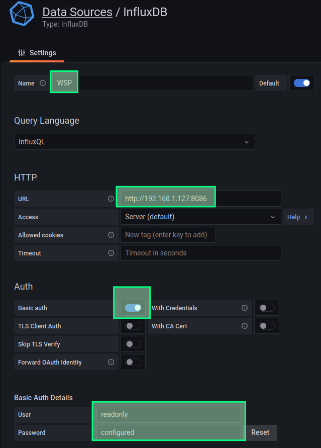
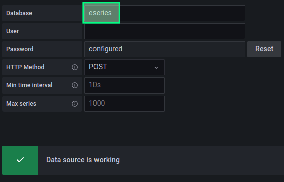

# Deploy InfluxDB v1 and Grafana v8 for EPA


- [Deploy InfluxDB v1 and Grafana v8 for EPA](#deploy-influxdb-v1-and-grafana-v8-for-epa)
  - [Assumptions](#assumptions)
  - [Sample configuration files](#sample-configuration-files)
  - [Create a namespace](#create-a-namespace)
  - [InfluxDB v1](#influxdb-v1)
    - [InfluxDB storage](#influxdb-storage)
    - [Other configuration, secrets and standing up InfluxDB](#other-configuration-secrets-and-standing-up-influxdb)
  - [Grafana v8](#grafana-v8)
  - [Connect Grafana to InfluxDB (deploy InfluxDB data source and Grafana dashboards)](#connect-grafana-to-influxdb-deploy-influxdb-data-source-and-grafana-dashboards)
    - [Manually import Grafana dashboards](#manually-import-grafana-dashboards)
  - [Wrap-up](#wrap-up)


## Assumptions

- Recent Kubernetes 
- EPA v3.4.2 (InfluxDB v1, Grafana v8, SANtricity OS 11.8)
- Existing InfluxDB, Grafana in the same namespace used for monitoring: `epa`

## Sample configuration files 

These are for reference only. Please use own files and best practices in production and remember to adjust the namespace if necessary.

- 01-pvc-influxdb.yaml: production-style PVCs (three volumes) for InfluxDB. Maybe you want to increase the size of the largest volume to more than 10GB. Storage Class name can also be changed if you don't have the one used here.
- 02-pvc-grafana.yaml: optional PVC for Grafana. Storage Class name can be changed if you don't have the one used here.
- 03-svc-influxdb.yaml: InfluxDB service 
- 04-svc-grafana.yaml: Grafana service
- 05-configmap-grafana.yaml: Grafana config map
- 06-dep-grafana.yaml: Grafana deployment that uses configmap from 05-configmap-grafana.yaml and 02-pvc-grafana.yaml
- 07-dep-influxdb.yaml: deployment for InfluxDB; it uses three volumes created in 01-pvc-influxdb.yaml

**NOTE:** for deployment files, do not forget to edit the image location (local build, Docker Hub, private registry, etc.)!

## Create a namespace

In this repo all examples and YAML files use the `epa` namespace. Many seem to standardize on `monitoring`, but you may have production monitoring applications there, so I use `epa` instead. Search & replace `namespace: epa` in the provided YAML files to use a different namespace.

```sh
kubectl create namespace epa
```

## InfluxDB v1

EPA v3 uses InvluxDB v1.

Port 8086/tcp is used for client connections and should be open to all *external* collector clients as well as Grafana (if Grafana runs externally). 

Collector does not use DB authentication, so either create firewall rules to allow only external collector by IP address, or run collector in the same namespace as InfluxDB to eliminate the need for external access to InfluxDB.

### InfluxDB storage

One, two or three PVs (in increasing order of resilience) may be used for InfluxDB storage. According to [the official documentation for v1.8](https://docs.influxdata.com/influxdb/v1.8/concepts/file-system-layout/?t=Kubernetes#kubernetes-default-paths), data paths are as follows:

- Data: /var/lib/influxdb/data/
- WAL:  /var/lib/influxdb/wal/
- Metastore: /var/lib/influxdb/meta/

Filesystem overview:

```raw
/var/lib/influxdb/
                  data/
                        TSM directories and files
                  wal/
                        WAL directories and files
                  meta/
                        meta.db
```

Permissions:

```raw
.../influxdb/       755
.../influxdb/data/  755
.../influxdb/meta/  755
.../influxdb/wal/   700
```


I because WAL and Meta aren't large, there isn't much disadvantage to using three separate PVCs, which is the approach taken by the sample YAML files. 

If you need reliable InfluxDB backups and plan to snapshot PVs to get that, it's safer to use one larger volume for everything, unless you have a way to take multi-PV snapshots (aka "group snapshots", "consistency group snapshots").

**NOTE:** In EPA v3.4.0 as we updated InfluxDB to 1.11.8, we noticed it runs as UID/GID 1500:1500.

### Other configuration, secrets and standing up InfluxDB

Various configuration options for InfluxDB may be viewed [here](https://docs.influxdata.com/influxdb/v1.8/introduction/install/).

InfluxDB secrets can be complex or simple depending on needs. EPA collector has never used authentication (because it used to runs on the same network as InfluxDB), so we cannot simply create INFLUXDB_USER (that's why it's marked-out) without modifying collector scripts to add authentication. 

If you will run collector and dbmanger as they are, create proper firewall rules for the InfluxDB external IP (to allow only external collectors to connect to it), or run collector(s) and dbmanger in the same namespace.

`influxdb.yaml` contains service configuration that listens on port 8086/tcp.

```sh
git clone https://github.com/scaleoutsean/eseries-perf-analyzer/
cd eseries-perf-analyzer/epa
pwd
# /home/sean/eseries-perf-analyzer/epa

# build EPA Collector (or build all by omitting "collector")
docker compose build collector
# see new images
docker images | grep epa

# use K8s samples
pwd
# /home/sean/eseries-perf-analyzer/kubernetes/samples

# create K8s secrets
kubectl -n epa create secret generic influxdb-creds \
  --from-literal=INFLUXDB_DB=eseries \
  --from-literal=INFLUXDB_ADMIN_USER=root \
  --from-literal=INFLUXDB_ADMIN_USER_PASSWORD=NetApp123 \
  --from-literal=INFLUXDB_HOST=influxdb  \
  --from-literal=INFLUXDB_HTTP_AUTH_ENABLED=false # \
  # --from-literal=INFLUXDB_READ_USER=grafana \
  # --from-literal=INFLUXDB_READ_USER_PASSWORD=grafana123readonlyUSER \
  # --from-literal=INFLUXDB_USER=monitor \
  # --from-literal=INFLUXDB_USER_PASSWORD=monitor123collector01 \
```

Alternatively use a credentials file.

```yaml
apiVersion: v1
kind: Secret
metadata:
  name: influxdb-creds
  namespace: epa
type: Opaque
stringData: 
  INFLUXDB_CONFIG_PATH: /etc/influxdb/influxdb.conf
  INFLUXDB_ADMIN_USER: root
  INFLUXDB_ADMIN_PASSWORD: NetApp123
  INFLUXDB_DB: epa
  # INFLUXDB_USER: grafana
  # INFLUXDB_USER_PASSWORD: grafana
```

**NOTE** 

- Collector can create specified (or if not, the default) database name in InfluxDB. You may set a different DB for each collector instance.
- EPA v3.4.2 does not use database authentication for Collector and Grafana, because they used to run in the same docker-compose deployment. This is how the NetApp EPA used to work. 
- For Grafana, is possible to create a read-only InfluxDB user account here, but if automated deployment of InfluxDB data source is used, authentication won't be set up. To work around that create a read-only account for Grafana here

With `influxdb-creds` ready, next we create PVCs, service and finally deployment:

```sh
kubectl -n epa apply -f 01-pvc-influxdb.yaml
kubectl -n epa apply -f 03-svc-influxdb.yaml
# 07-dep-influxdb.yaml uses influxdb-creds created with kubectl (see above)
kubectl -n epa apply -f 07-dep-influxdb.yaml
# persistentvolumeclaim/influxdb-data-pvc created
# persistentvolumeclaim/influxdb-wal-pvc created
# persistentvolumeclaim/influxdb-meta-pvc created
# deployment.apps/influxdb created
# service/influxdb created

kubectl -n epa get services
# NAME       TYPE           CLUSTER-IP      EXTERNAL-IP   PORT(S)          AGE
# influxdb   LoadBalancer   10.109.24.223   <pending>     8086:32328/TCP   37s
```

As you can see there's no `EXTERNAL-IP` which means InfluxDB is not exposed to LAN or the Internet. This is fine if the rest of containers will run in the `epa` namespace. 

If you need to use InfluxDB from outside of Kubernetes (if either Grafana, or collector will run externally), [add `EXTERNAL-IP`](https://kubernetes.io/docs/tutorials/stateless-application/expose-external-ip-address/) depending on your environment.

## Grafana v8

Grafana can be deployed in several ways. High-level choices:

- Use official Grafana instructions and container (DIY style)
- Use EPA Grafana container (built with `make build` above)

EPA Grafana is the same as official Grafana (Open Source), but it includes the config file `./epa/grafana/grafana.ini`. If you want to customize that file for your Grafana (to remove "phone home", for example), edit that file and from `./epa` run `make build` again. Remember to use the resulting image in `07-dep-grafana.yaml`.

If you want to use official image, see [the official instructions](https://grafana.com/docs/grafana/latest/setup-grafana/installation/kubernetes/) or [one](https://medium.com/starschema-blog/monitor-your-infrastructure-with-influxdb-and-grafana-on-kubernetes-a299a0afe3d2) [of](https://iceburn.medium.com/build-from-scratch-grafana-and-prometheus-on-minikube-228d4e9cfda0) the many community guides for version 8.

In both cases default credentials are the same: admin/admin can be used to log in.

In production, Grafana service would be behind a reverse proxy. There are too many ways to do that and that's out of scope here, so I'll just assume this was done the way you wanted.

```sh
kubectl -n epa apply -f 02-pvc-grafana.yaml
kubectl -n epa apply -f 04-svc-grafana.yaml
kubectl -n epa apply -f 05-configmap-grafana.yaml
kubectl -n epa apply -f 06-dep-grafana.yaml

kubectl -n epa get services
# NAME       TYPE           CLUSTER-IP      EXTERNAL-IP   PORT(S)          AGE
# grafana    LoadBalancer   10.108.183.87   <pending>     3000:30104/TCP   46m
# influxdb   LoadBalancer   10.109.24.223   <pending>     8086:32328/TCP   37s
```

Like with InfluxDB, you need `EXTERNAL-IP` or port forwarding if you want to connect from the outside world.

With Grafana ready, we can add a InfluxDB v1 data source. You can do it manually (create the `EPA` data source and import dashboards from `./epa/grafana-init/dashboards`) or try the `grafana-init` container in this repo.

## Connect Grafana to InfluxDB (deploy InfluxDB data source and Grafana dashboards)

InfluxDB and Grafana must be reachable at `influxdb:8086` and `http://grafana:3000`, respectively.

In my test environment InfluxDB was available at an `EXTERNAL-IP` and Grafana Data Source was added with Basic Auth like this ("WSP" comes from Web Services Proxy, the data source name inherited from upstream EPA v3.0.0; but since EPA v3.4.0 version 3 defaults to **`EPA`**).



If authentication was not configured in the InfluxDB section (`kubectl -n epa create secret generic influxdb-creds`), or you don't want to use authentication for Grafana, it's unnecessary to enable Basic Auth and provide credentials for Grafana account on InfluxDB. But if your InfluxDB is open to LAN clients, it's better to protect it and use a read-only account in Grafana.

Also notice that EPA by default uses the `eseries` database. If Grafana connects to InfluxDB while the DB is still missing, Grafana will complain about the missing database (screenshot below). Login to InfluxDB or use its API address to create a database. You can also use the `utils` container in the same namespace to do that easily. Or you can run Collector to create the DB (see Collector help or the FAQs).


Once a DB exists and is configured Grafana data sources, Save & Test will show that Data Source is fully validated (below).



### Manually import Grafana dashboards

The EPA dashboards can be found in `./epa/grafana-init/dashboards`.

Visit `http://${GRAFANA_IP}:3000/dashboard/import` to import them.

## Wrap-up

Now the correct functioning of Grafana and InfluxDB can be checked.

In this section InfluxDB and Grafana were deployed to the same namespace (`epa`), exposed as services, and configured so that Grafana has access to InfluxDB databases and EPA dashboards.

